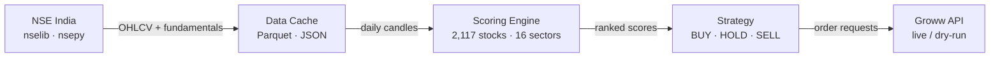
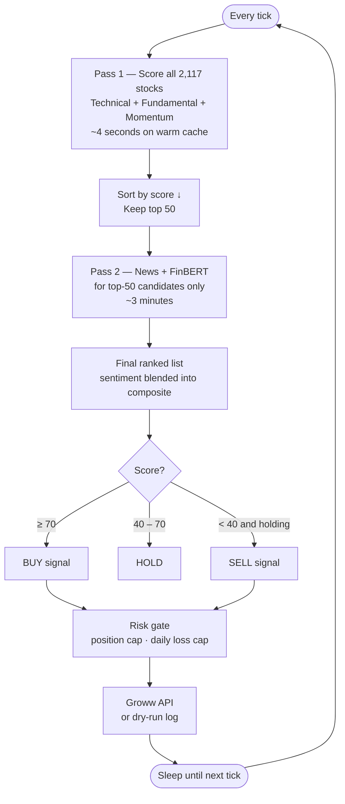
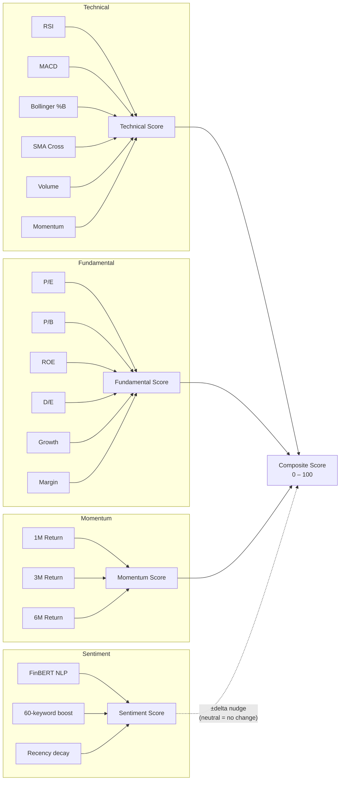
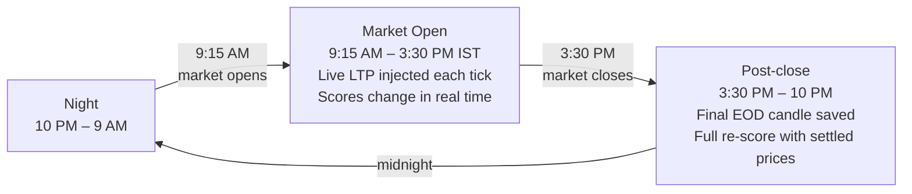

# NSE Trading Bot

A fully automated, score-driven equity trading bot for the Indian stock market (NSE), built on the Groww API. Scores all 2,117 NSE-listed stocks every tick using technical, fundamental, momentum, and news sentiment signals.

---

## Table of Contents

1. [Architecture](#architecture)
2. [How Scoring Works](#how-scoring-works)
3. [Market Hours Behaviour](#market-hours-behaviour)
4. [Background & Theory](#background--theory)
   - [Technical Indicators](#technical-indicators)
   - [Fundamental Indicators](#fundamental-indicators)
   - [News Sentiment — FinBERT](#news-sentiment--finbert)
   - [Composite Score Formula](#composite-score-formula)
5. [Sector-Specific Tuning](#sector-specific-tuning)
6. [Project Structure](#project-structure)
7. [Setup & Running](#setup--running)
8. [Customising Your Strategy](#customising-your-strategy)

---

## Architecture



| Component | What it does |
|-----------|-------------|
| **NSE India** | Source of truth — 2,117 EQ-series symbols, daily OHLCV, fundamentals |
| **Data Cache** | Stores OHLCV as Parquet files, fundamentals as JSON; only downloads what's stale |
| **Scoring Engine** | Two-pass scorer — fast technical pass on all stocks, then FinBERT news pass on top-50 |
| **Strategy** | Converts scores into signals, enforces risk rules (position cap, daily loss cap) |
| **Groww API** | Places real orders or simulates them in dry-run mode |

---

## How Scoring Works

Scoring runs in **two passes** to balance speed and accuracy.



### The four scoring pillars



**Key property of sentiment blending:**
```
delta   = (sentiment − 50) / 50      # maps 0–100 → −1.0 to +1.0
boost   = delta × weight × base_score
final   = base_score + boost

Sentiment = 50 (no news) → delta = 0 → score unchanged  ✓
Sentiment = 80 (positive) → score nudged up  ✓
Sentiment = 20 (negative) → score nudged down  ✓
```

Neutral news never penalises a bullish stock.

---

## Market Hours Behaviour



During market hours the bot fetches the **current intraday candle** (live Open / High / Low / LTP / Volume) from NSE's quote API and injects it as today's row before scoring. This means RSI, MACD, and Bollinger recompute on the **live price**, not last night's close.

| Time | Data | Score behaviour |
|------|------|-----------------|
| Market open (9:15 AM – 3:30 PM) | Live LTP updated every 90 s | Scores shift with price throughout the day |
| After market close | Final EOD candle | One authoritative recalculation |
| Night | Cached EOD data | Scores are frozen (no new price data) |

---

## Background & Theory

### Why algorithmic trading?

Human traders suffer from cognitive biases — fear, greed, anchoring, recency bias. A rules-based algorithm removes emotion. The key insight from decades of academic and practitioner research:

> **Prices are not random. Patterns exist. But they are short-lived and require speed, scale, and discipline to exploit.**

This bot combines two schools of analysis — scored together, weighted per sector:

| School | Premise | Tools |
|--------|---------|-------|
| **Technical** | Price and volume already reflect all known information. Past patterns predict near-term direction. | RSI, MACD, Bollinger, SMA Cross |
| **Fundamental** | True value is determined by business performance. Price eventually converges to value. | P/E, P/B, ROE, Growth |
| **Sentiment** | News and narrative move prices before fundamentals catch up. | FinBERT NLP, keyword events |

---

## Technical Indicators

All computed from daily OHLCV using pure pandas — no TA library dependency.

### RSI — Relative Strength Index
**Origin:** J. Welles Wilder Jr., 1978.

Measures the speed and magnitude of recent price changes. Identifies overbought / oversold conditions.

```
avg_gain = EMA(daily_gain, 14)
avg_loss = EMA(daily_loss, 14)
RS       = avg_gain / avg_loss
RSI      = 100 − (100 / (1 + RS))

RSI < 30  → oversold  → bullish signal
RSI > 70  → overbought → bearish signal
```
**Weight:** 15% of technical pillar

---

### MACD — Moving Average Convergence Divergence
**Origin:** Gerald Appel, late 1970s.

Captures the relationship between two EMAs. When the fast EMA crosses above the slow EMA, momentum is shifting upward.

```
MACD      = EMA(Close, 12) − EMA(Close, 26)
Signal    = EMA(MACD, 9)
Histogram = MACD − Signal    ← growing histogram = accelerating momentum
```
**Weight:** 20% of technical pillar

---

### Bollinger Bands
**Origin:** John Bollinger, 1980s.

A volatility band placed ±2 standard deviations around a 20-day moving average.

```
SMA_20  = Rolling mean, window=20
STD_20  = Rolling std,  window=20
Upper   = SMA_20 + 2 × STD_20
Lower   = SMA_20 − 2 × STD_20
%B      = (Close − Lower) / (Upper − Lower)

%B < 0.2 → near lower band → oversold → bullish
%B > 0.8 → near upper band → overbought → bearish
```
**Weight:** 15% of technical pillar

---

### SMA Crossover (Golden / Death Cross)
**Origin:** Charles Dow, late 1800s. Studied academically since the 1960s.

When the 50-day average rises above the 200-day average, the long-term trend is shifting bullish.

```
Price > SMA50 > SMA200          → score 100  (full bull alignment)
SMA50 just crossed above SMA200 → score  90  (Golden Cross)
SMA50 just crossed below SMA200 → score  10  (Death Cross)
Price < SMA50 < SMA200          → score   0  (full bear alignment)
```
**Weight:** 20% of technical pillar

---

### Volume Trend
**Origin:** Joseph Granville's On-Balance Volume (OBV), 1963.

Price moves are more significant when accompanied by high volume. Rising price on low volume = weak move, likely to reverse.

```
vol_ratio = Volume_today / Volume_20day_avg

> 2.0 → score 90   (volume spike — strong confirmation)
> 1.5 → score 75
> 1.0 → score 60   (above average)
< 0.5 → score 25   (drying up)
```
**Weight:** 15% of technical pillar

---

### Price Momentum
**Origin:** Jegadeesh & Titman, 1993 — *Returns to Buying Winners and Selling Losers.*

Stocks that performed well recently tend to continue in the near term (3–12 month horizon). One of the most robust anomalies in financial economics.

```
return_1m = (Close_today − Close_20d_ago)  / Close_20d_ago
return_3m = (Close_today − Close_60d_ago)  / Close_60d_ago
return_6m = (Close_today − Close_120d_ago) / Close_120d_ago

momentum_score = 0.5 × score(1m) + 0.3 × score(3m) + 0.2 × score(6m)
```
**Weight:** 15% of technical pillar

---

## Fundamental Indicators

Fetched weekly from NSE's equity quote API. If unavailable, the bot scores this pillar at 50 (neutral) and continues with technical-only scoring.

| Metric | Formula | What it captures |
|--------|---------|-----------------|
| **P/E** | Price / EPS | Earnings valuation — lower = cheaper |
| **P/B** | Price / Book Value | Asset valuation — key for banking stocks |
| **ROE** | Net Income / Equity × 100 | Capital efficiency — Buffett's primary metric |
| **D/E** | Total Debt / Total Equity | Leverage risk |
| **Revenue Growth** | (Revenue_now − Revenue_prev) / Revenue_prev | Top-line expansion |
| **EPS Growth** | (EPS_now − EPS_prev) / EPS_prev | Bottom-line expansion |
| **Profit Margin** | Net Income / Revenue × 100 | Pricing power and cost discipline |
| **Dividend Yield** | Annual Dividend / Price × 100 | Income signal |

---

## News Sentiment — FinBERT

**What:** FinBERT is a BERT-based model fine-tuned on financial text (SEC 10-K filings, analyst reports, financial news). It classifies text as **positive / negative / neutral** with far higher accuracy than generic NLP models on financial language.

**Why not VADER or generic BERT?** VADER uses a fixed dictionary — it misclassifies financial jargon ("beat estimates" → neutral, should be positive). Generic BERT was not trained on financial text. FinBERT was purpose-built for this domain.

**Pipeline per stock (top-50 only, Pass 2):**

```
1. Fetch RSS articles from:
   ├── Economic Times
   ├── LiveMint
   ├── Moneycontrol
   ├── Business Standard
   └── Google News (symbol + company name query)

2. For each article:
   ├── FinBERT → P(positive), P(negative), P(neutral)
   ├── sentiment_raw = P(positive) − P(negative)  → −1.0 to +1.0
   ├── keyword_delta  → scan 60 financial keywords (IPO, SEBI notice, dividend, etc.)
   └── recency_decay  → recent articles weighted higher (half-life = 12 hours)

3. Weighted average across all articles → final sentiment 0–100

4. Blend into composite score:
   delta = (sentiment − 50) / 50
   final = base_score + delta × weight × base_score
```

**Result:** A stock with no news stays exactly at its technical/fundamental score. Positive news (earnings beat, new product, dividend) nudges it up. Negative news (SEBI notice, fraud, downgrade) nudges it down.

---

## Composite Score Formula

```
Composite =
    Technical_score    × weight_technical
  + Fundamental_score  × weight_fundamental
  + Momentum_score     × weight_momentum

Then sentiment-blended:
  delta  = (Sentiment − 50) / 50
  Final  = Composite + delta × 0.15 × Composite
```

All weights sum to 1.0. Default pillar weights (overridden per sector):

| Sector | Technical | Fundamental | Momentum |
|--------|-----------|-------------|----------|
| DEFAULT | 40% | 35% | 25% |
| IT | 45% | 30% | 25% |
| BANKING | 35% | 45% | 20% |
| PHARMA | 40% | 35% | 25% |
| METAL | 50% | 20% | 30% |
| FMCG | 30% | 50% | 20% |
| REALTY | 45% | 25% | 30% |

**Signal thresholds:**

| Score | Signal |
|-------|--------|
| ≥ 70 | **BUY** — strong multi-factor alignment |
| 40–70 | **HOLD** — mixed signals |
| < 40 | **SELL** — deteriorating setup |

---

## Sector-Specific Tuning

Different industries have structurally different profiles. The same P/E of 30 means something very different for an IT company vs a PSU bank. The registry applies per-sector overrides on top of defaults.

**Banking overrides (within fundamental pillar):**
```
D/E weight     = 0%   ← banks are structurally leveraged (deposits = liabilities)
P/B weight     = 20%  ← primary banking valuation metric
ROE weight     = 22%  ← core profitability proxy
Current Ratio  = 0%   ← irrelevant for financial institutions
```

**IT overrides (within fundamental pillar):**
```
Revenue Growth   = 20%  ← growth is the core IT thesis
Earnings Growth  = 18%  ← margin and EPS expansion
Margin           = 15%  ← IT has the highest margins in India
P/E              = 10%  ← IT trades at premium P/E — penalise less
```

All weights are externalised to `.env` — no code changes needed to tune them.

---

## Project Structure

```
TradingBot/
│
├── bot.py               # Entry point — wires all components, runs the tick loop
├── config.py            # All settings loaded from .env (100+ variables)
├── market_hours.py      # NSE trading hours check (IST-aware)
├── logger.py            # Rotating file + console logger
├── orders.py            # OrderManager — wraps Groww API
├── positions.py         # In-memory position + P&L tracker
├── universe.py          # Stock universe + sector mapping (nselib)
├── .env.example         # Template — copy to .env and fill in credentials
├── requirements.txt
│
├── data/
│   ├── cache.py         # Parquet OHLCV cache + JSON fundamentals cache
│   └── fetcher.py       # nselib (primary) + nsepy (fallback) + live NSE quote API
│
├── news/
│   ├── sources.py       # RSS feed definitions (ET, Mint, MC, BS, Google News)
│   ├── fetcher.py       # Fetches + caches articles (30-min TTL)
│   └── sentiment.py     # FinBERT backend + keyword booster + recency decay
│
├── scoring/
│   ├── engine.py        # Two-pass orchestrator (Pass 1: all, Pass 2: top-50 + news)
│   ├── registry.py      # Sector → scorer mapping + live weight update API
│   └── formulas/
│       ├── base.py              # StockScore dataclass + BaseScorer abstract class
│       ├── technical.py         # RSI, MACD, Bollinger, SMA cross, Volume, Momentum
│       ├── fundamental.py       # P/E, P/B, ROE, D/E, Growth, Margin, Dividend
│       ├── news_sentiment.py    # Bridges NewsFetcher + SentimentAnalyzer → score
│       └── sectors/
│           ├── default.py       # tech=40, fund=35, mom=25
│           ├── banking.py       # tech=35, fund=45, mom=20
│           ├── it.py            # tech=45, fund=30, mom=25
│           └── pharma.py        # tech=40, fund=35, mom=25
│
├── strategies/
│   └── score_based.py   # BUY ≥ 70, SELL < 40 — all weights from config
│
├── cache/               # Auto-created at runtime
│   ├── universe.json
│   ├── ohlcv/<SYMBOL>.parquet
│   └── fundamentals/<SYMBOL>.json
│
└── logs/
    └── bot.log          # Rotating daily log (7-day retention)
```

---

## Setup & Running

```bash
# 1. Clone and create virtual environment
git clone <repo>
cd TradingBot
python -m venv .venv
source .venv/bin/activate          # Windows: .venv\Scripts\activate

# 2. Install dependencies
pip install -r requirements.txt

# 3. Configure credentials and weights
cp .env.example .env
# Edit .env — add your GROWW_API_KEY and GROWW_SECRET

# 4. Run (dry run by default — no real orders placed)
python bot.py
```

**What to expect:**

| Run | What happens |
|-----|-------------|
| First ever run | Downloads 1 year × 2,117 symbols (~5–15 min), then scores |
| Subsequent runs | Parquet cache is warm — Pass 1 takes ~4 seconds |
| During market hours | Live LTP injected; scores shift with the market |
| Night / weekend | Scores frozen on last EOD data (correct — no new data) |

### Key `.env` settings

```bash
BOT_DRY_RUN=true                 # set false only when ready to trade real money

BOT_POLL_INTERVAL=300            # seconds between ticks (60 during market hours)

SCORE_BUY_THRESHOLD=70           # composite score to trigger BUY
SCORE_SELL_THRESHOLD=40          # composite score to trigger SELL
SCORE_TOP_N=50                   # only top-50 stocks go through FinBERT in Pass 2

RISK_MAX_HOLDINGS=10             # max simultaneous positions
RISK_MAX_DAILY_LOSS=1000         # auto-pause if P&L drops below -₹1000

SENTIMENT_WEIGHT=0.15            # how much news moves the final score (0 to disable)
SENTIMENT_BACKEND=finbert        # finbert (accurate) or vader (fast)
```

---

## Customising Your Strategy

All weights are in `.env`. For code-level overrides:

```python
# Override pillar weights for a sector
registry.set_weights("IT", technical=0.55, fundamental=0.25, momentum=0.20)

# Tune sub-indicators within a pillar
registry.set_technical_weights("PHARMA", macd=0.30, rsi=0.15, momentum=0.25)
registry.set_fundamental_weights("BANKING", roe=0.28, pb=0.22)

# Inject a fully custom metric
def npa_quality(df, fund):
    """Lower NPA ratio → higher score (banking-specific)."""
    npa = fund.get("npa_ratio", 0.03)
    return max(0.0, 100.0 - npa * 2000)

registry.add_metric("BANKING", "npa_quality", npa_quality, weight=0.12)

# Replace an entire sector scorer
from my_scorer import MyEnergyScorer
registry.register("ENERGY", MyEnergyScorer())
```

### Raise or lower aggressiveness

```bash
# More selective (fewer but higher-conviction buys)
SCORE_BUY_THRESHOLD=75
SCORE_TOP_N=20

# More aggressive (more buys, accepts lower-conviction signals)
SCORE_BUY_THRESHOLD=65
SCORE_TOP_N=100
RISK_MAX_HOLDINGS=20
```
