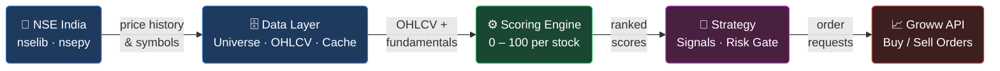

# NSE Trading Bot

A fully automated, score-driven equity trading bot for the Indian stock market (NSE), built on the Groww API.

---

## Table of Contents

1. [High-Level Architecture](#high-level-architecture)
2. [Detailed Flowchart](#detailed-flowchart)
3. [What This Bot Actually Does](#what-this-bot-actually-does)
4. [Background & Theory](#background--theory)
   - [Why Algorithmic Trading?](#why-algorithmic-trading)
   - [The Scoring Philosophy](#the-scoring-philosophy)
5. [Technical Indicators — Theory & Formula](#technical-indicators--theory--formula)
   - [RSI — Relative Strength Index](#1-rsi--relative-strength-index)
   - [MACD — Moving Average Convergence Divergence](#2-macd--moving-average-convergence-divergence)
   - [Bollinger Bands](#3-bollinger-bands)
   - [SMA Crossover](#4-sma-crossover-golden--death-cross)
   - [Volume Trend](#5-volume-trend)
   - [Price Momentum](#6-price-momentum)
6. [Fundamental Indicators — Theory & Formula](#fundamental-indicators--theory--formula)
   - [P/E Ratio](#1-pe-ratio-price-to-earnings)
   - [P/B Ratio](#2-pb-ratio-price-to-book)
   - [ROE](#3-roe-return-on-equity)
   - [Debt-to-Equity](#4-debt-to-equity-ratio)
   - [Revenue & Earnings Growth](#5-revenue--earnings-growth)
   - [Profit Margin](#6-profit-margin)
7. [Composite Score — How It Is Derived](#composite-score--how-it-is-derived)
8. [Sector-Specific Tuning](#sector-specific-tuning)
9. [Project Structure](#project-structure)
10. [Data Pipeline](#data-pipeline)
11. [How to Run](#how-to-run)
12. [Customising Your Strategy](#customising-your-strategy)

---

## High-Level Architecture

Five layers — data flows left to right, orders exit at the end.



| Layer | Responsibility |
|-------|----------------|
| **NSE India** | Source of truth — 2,117 symbols, daily OHLCV, fundamentals |
| **Data Layer** | Fetches, normalises, and caches all market data to Parquet |
| **Scoring Engine** | Scores every stock 0–100 using 16 sector-aware formulas |
| **Strategy** | Converts scores into BUY/SELL signals, enforces risk rules |
| **Groww API** | Executes real orders (or simulates them in dry-run mode) |

---

## Detailed Flowchart


---

## What This Bot Actually Does

Every tick (default every 5 minutes during market hours):

1. **Fetches** the latest daily OHLCV candle for all 2,117 NSE EQ-series stocks from nselib (cached in Parquet — only new candles are downloaded).
2. **Scores** every stock on a 0–100 scale using a weighted blend of technical, fundamental, and momentum signals.
3. **Ranks** all 2,117 stocks by score.
4. **Generates signals:**
   - `BUY`  — stock scores ≥ 70 AND you don't already hold it AND you have open slot (≤ 10 holdings)
   - `SELL` — you hold a stock AND its score has dropped below 40
   - `HOLD` — everything else
5. **Passes signals through a risk gate** (daily loss cap, position cap).
6. **Places orders** on Groww (dry run by default — no real money until you flip the flag).

---

## Background & Theory

### Why Algorithmic Trading?

Human traders suffer from cognitive biases — fear, greed, anchoring, recency bias. A rules-based algorithm removes emotion. The key insight from decades of academic and practitioner research is:

> **Prices are not random. Patterns exist. But they are short-lived and require speed, scale, and discipline to exploit.**

The two dominant schools:

| School | Premise | Tools |
|---|---|---|
| **Technical Analysis** | Price and volume already reflect all known information. Past price patterns predict near-term direction. | RSI, MACD, Moving Averages, Bollinger Bands |
| **Fundamental Analysis** | A stock's true value is determined by business performance. Price eventually converges to value. | P/E, P/B, ROE, Growth Rates |

This bot uses **both** — scored and blended per sector, because different industries have different valuation dynamics.

---

### The Scoring Philosophy

Rather than a binary buy/sell signal, every stock gets a **continuous score from 0 to 100**. This is inspired by:

- **Quantitative factor investing** (Fama-French, AQR Capital) — rank stocks by factors, buy top decile, sell bottom decile
- **Z-score normalisation** — each raw indicator is converted to a 0–100 scale so they can be meaningfully combined
- **Sector-relative scoring** — banking stocks are compared differently from IT stocks because their fundamental profiles are structurally different

---

## Technical Indicators — Theory & Formula

All technical indicators are computed from the **daily OHLCV** (Open, High, Low, Close, Volume) time series using pure pandas/numpy — no external TA library dependency.

---

### 1. RSI — Relative Strength Index

**History:** Developed by J. Welles Wilder Jr. in 1978, published in *New Concepts in Technical Trading Systems*. One of the most widely used momentum oscillators.

**Theory:** Measures the speed and magnitude of recent price changes. Identifies overbought (likely to reverse down) and oversold (likely to reverse up) conditions.

**Formula:**
```
Step 1 — For each day:
    gain = max(Close_today - Close_yesterday, 0)
    loss = max(Close_yesterday - Close_today, 0)

Step 2 — 14-period smoothed averages:
    avg_gain = EMA(gain, 14)
    avg_loss = EMA(loss, 14)

Step 3:
    RS  = avg_gain / avg_loss
    RSI = 100 - (100 / (1 + RS))
```

**Interpretation:**
```
RSI > 70  →  Overbought   →  Bearish signal (potential sell)
RSI < 30  →  Oversold     →  Bullish signal (potential buy)
RSI 40–60 →  Neutral zone
```

**Score conversion (0–100):**
```
RSI < 30  →  score = 85 + (30 - RSI) × 0.5        # strong buy zone
RSI 30–50 →  score = 60 + (50 - RSI) × 1.25       # mild buy zone
RSI 50–70 →  score = 60 - (RSI - 50) × 1.5        # neutral to mild sell
RSI > 70  →  score = max(0, 30 - (RSI - 70) × 1)  # overbought
```

**Weight in composite:** 15%

---

### 2. MACD — Moving Average Convergence Divergence

**History:** Developed by Gerald Appel in the late 1970s. One of the most cited indicators in institutional research.

**Theory:** Captures the relationship between two EMAs of price. When the fast EMA crosses above the slow EMA, momentum is shifting upward. The histogram (MACD – Signal) measures acceleration of that shift.

**Formula:**
```
EMA_12   = Exponential Moving Average of Close, span=12
EMA_26   = Exponential Moving Average of Close, span=26
MACD     = EMA_12 - EMA_26
Signal   = EMA(MACD, span=9)
Histogram = MACD - Signal
```

**Interpretation:**
```
Histogram > 0 and growing   →  Strong bullish momentum
Histogram > 0 and shrinking →  Momentum fading
MACD crosses above Signal   →  Buy signal
MACD crosses below Signal   →  Sell signal
```

**Score conversion (0–100):**
```
Based on histogram relative to its recent range:
  position = (histogram - min_hist) / (max_hist - min_hist)
  score    = position × 100
```

**Weight in composite:** 20%

---

### 3. Bollinger Bands

**History:** Developed by John Bollinger in the 1980s. Widely used in equity, forex, and derivatives markets.

**Theory:** A volatility band placed above and below a moving average. When price touches the lower band, it may be oversold. When it touches the upper band, it may be overbought. The width of the band reflects market volatility.

**Formula:**
```
SMA_20   = Simple Moving Average of Close, period=20
STD_20   = Rolling Standard Deviation of Close, period=20

Upper Band = SMA_20 + 2 × STD_20
Lower Band = SMA_20 - 2 × STD_20

Band Width = (Upper - Lower) / SMA_20   ← volatility proxy
%B         = (Close - Lower) / (Upper - Lower)   ← position within band
```

**Interpretation:**
```
%B < 0.2   →  Near/below lower band → oversold → bullish
%B > 0.8   →  Near/above upper band → overbought → bearish
%B = 0.5   →  At midpoint (SMA)
```

**Score conversion (0–100):**
```
score = (1 - %B) × 100    # inverted: lower band position = higher score
clamped to [0, 100]
```

**Weight in composite:** 15%

---

### 4. SMA Crossover (Golden / Death Cross)

**History:** One of the oldest technical signals, dating to Charles Dow's original theory (late 1800s). The "Golden Cross" (50-day crossing above 200-day) has been studied in academic literature since the 1960s.

**Theory:** When a short-term average rises above a long-term average, the trend is shifting to bullish. The alignment of Price > SMA50 > SMA200 is the most bullish possible configuration.

**Formula:**
```
SMA_50  = Rolling Mean of Close, window=50
SMA_200 = Rolling Mean of Close, window=200

Score based on alignment:
  Price > SMA50 > SMA200  →  100  (full bull alignment)
  Price > SMA50 < SMA200  →   65  (short-term bullish only)
  Price > SMA50 = SMA200  →   60  (at crossover, watch closely)
  SMA50 just crossed above SMA200  →  90  (Golden Cross — strong signal)
  SMA50 just crossed below SMA200  →  10  (Death Cross — strong sell)
  Price < SMA50 < SMA200  →    0  (full bear alignment)
```

**Weight in composite:** 20%

---

### 5. Volume Trend

**History:** Volume analysis has been a cornerstone of Dow Theory and was formalised by Joseph Granville's On-Balance Volume (OBV) in 1963.

**Theory:** Price moves are more significant when accompanied by high volume. Rising price on high volume = institutional buying. Rising price on low volume = weak move, likely to reverse.

**Formula:**
```
vol_ratio    = Volume_today / Volume_20day_avg

Score:
  vol_ratio > 2.0  →  score = 90  (volume spike — strong confirmation)
  vol_ratio > 1.5  →  score = 75
  vol_ratio > 1.0  →  score = 60  (above average)
  vol_ratio < 0.5  →  score = 25  (drying up — weak move)
  vol_ratio < 0.3  →  score = 10  (very low — no conviction)
```

**Weight in composite:** 15%

---

### 6. Price Momentum

**History:** Momentum as a factor was academically documented by Jegadeesh & Titman (1993) in *Returns to Buying Winners and Selling Losers*. It is one of the most robust anomalies in financial economics, surviving out-of-sample tests across 40+ markets.

**Theory:** Stocks that have performed well recently tend to continue performing well in the near term (3–12 month horizon). This is attributed to delayed price discovery, investor herding, and earnings revision momentum.

**Formula:**
```
return_1m  = (Close_today - Close_20d_ago)  / Close_20d_ago
return_3m  = (Close_today - Close_60d_ago)  / Close_60d_ago
return_6m  = (Close_today - Close_120d_ago) / Close_120d_ago

momentum_score = 0.5 × score(return_1m)
               + 0.3 × score(return_3m)
               + 0.2 × score(return_6m)

Where score(return):
  return > +20%  →  100
  return > +10%  →   80
  return >   0%  →   60
  return >  -5%  →   40
  return > -15%  →   20
  return ≤ -15%  →    0
```

**Weight in composite:** Acts as the `momentum` pillar in top-level blending.

---

## Fundamental Indicators — Theory & Formula

Fundamental data is fetched weekly from NSE's public equity quote API. Where unavailable, the score defaults to 50 (neutral) — the bot degrades gracefully to technical-only scoring.

---

### 1. P/E Ratio (Price to Earnings)

**Theory:** How much investors pay per rupee of earnings. A lower P/E relative to sector peers suggests the stock is undervalued.

**Formula:**
```
P/E = Market Price per Share / Earnings per Share (EPS)
```

**Score conversion (sector-relative, lower is better for value):**
```
P/E < 10         →  score = 90  (deeply undervalued)
P/E 10–15        →  score = 80
P/E 15–25        →  score = 65  (fairly valued)
P/E 25–40        →  score = 45  (growth premium)
P/E > 40         →  score = 25  (expensive)
P/E < 0 (loss)   →  score = 20
```

**Weight in composite:** 15% of fundamental pillar (varies by sector)

---

### 2. P/B Ratio (Price to Book)

**Theory:** Compares market value to net asset value. Very relevant for asset-heavy sectors (banking, NBFC) where book value is a reliable proxy for intrinsic worth.

**Formula:**
```
P/B = Market Price per Share / Book Value per Share
Book Value = Total Assets - Total Liabilities
```

**Score conversion:**
```
P/B < 1    →  score = 95  (trading below asset value — rare, strong buy)
P/B 1–2    →  score = 80
P/B 2–4    →  score = 65
P/B 4–8    →  score = 40
P/B > 8    →  score = 20
```

**Weight:** 10% default; raised to **20% for Banking** (P/B is the primary banking valuation metric)

---

### 3. ROE (Return on Equity)

**Theory:** Measures how efficiently management uses shareholders' money to generate profit. Warren Buffett's primary screening metric — he targets ROE > 15% consistently.

**Formula:**
```
ROE = Net Income / Shareholders' Equity × 100
```

**Score conversion:**
```
ROE > 25%   →  score = 95  (exceptional capital efficiency)
ROE > 20%   →  score = 85
ROE > 15%   →  score = 75  (Buffett threshold)
ROE > 10%   →  score = 60
ROE > 5%    →  score = 40
ROE ≤ 0%    →  score = 10
```

**Weight:** 15% default; raised to **22% for Banking** (ROE is the core banking profitability metric)

---

### 4. Debt-to-Equity Ratio

**Theory:** Measures financial leverage. High debt amplifies both gains and losses. During market downturns, highly-leveraged companies face existential risk.

**Formula:**
```
D/E = Total Debt / Total Shareholders' Equity
```

**Score conversion (lower debt = safer = higher score):**
```
D/E < 0.3   →  score = 95  (virtually debt-free)
D/E < 0.5   →  score = 85
D/E < 1.0   →  score = 70  (manageable)
D/E < 2.0   →  score = 50
D/E < 3.0   →  score = 30
D/E ≥ 3.0   →  score = 10
```

**Special case:** D/E is set to **weight=0 for Banking** — banks are structurally leveraged (deposits are liabilities), so this metric is meaningless for them.

---

### 5. Revenue & Earnings Growth

**Theory:** Growth investors (Philip Fisher, Peter Lynch) argue that earnings growth is the primary driver of long-term stock price appreciation. A stock that grows earnings at 20% per year will roughly double its price every 3–4 years.

**Formula:**
```
Revenue Growth  = (Revenue_this_year - Revenue_last_year) / Revenue_last_year
Earnings Growth = (EPS_this_year - EPS_last_year) / EPS_last_year
```

**Score conversion:**
```
Growth > 30%   →  score = 95
Growth > 20%   →  score = 85
Growth > 10%   →  score = 70
Growth >  0%   →  score = 55  (growing, but slowly)
Growth < 0%    →  score = 20  (shrinking — negative signal)
```

---

### 6. Profit Margin

**Theory:** Operating margin and net margin measure pricing power and cost discipline. High-margin businesses (software, pharmaceuticals) are harder to compete with and generate more free cash flow.

**Formula:**
```
Net Margin      = Net Income / Revenue × 100
Operating Margin = Operating Income / Revenue × 100
```

**Score conversion:**
```
Margin > 25%   →  score = 95  (world-class — typical for IT/Pharma)
Margin > 15%   →  score = 80
Margin > 10%   →  score = 65
Margin >  5%   →  score = 50
Margin >  0%   →  score = 30
Margin ≤  0%   →  score = 5   (loss-making)
```

---

## Composite Score — How It Is Derived

Each stock's final score is a **three-pillar weighted average**:

```
Composite Score =
    (Technical Score  × weight_technical)
  + (Fundamental Score × weight_fundamental)
  + (Momentum Score   × weight_momentum)

Where weights sum to 1.0
```

Each pillar is itself a weighted average of its sub-indicators:

```
Technical Score =
    RSI_score        × 0.15
  + MACD_score       × 0.20
  + Bollinger_score  × 0.15
  + SMA_cross_score  × 0.20
  + Volume_score     × 0.15
  + Momentum_score   × 0.15

Fundamental Score =
    PE_score         × 0.15
  + PB_score         × 0.10
  + ROE_score        × 0.15
  + DE_score         × 0.12
  + CurrentRatio     × 0.08
  + RevenueGrowth    × 0.12
  + EarningsGrowth   × 0.12
  + Margin_score     × 0.10
  + DividendYield    × 0.06
```

All individual metric scores are on a **0–100 scale**. The final composite is therefore also 0–100, where:

| Score | Signal |
|---|---|
| 70 – 100 | **BUY** — strong multi-factor alignment |
| 40 – 70  | **HOLD** — mixed signals, monitor |
| 0  – 40  | **SELL** — deteriorating setup |

---

## Sector-Specific Tuning

Different industries have structurally different risk-reward profiles. The same P/E of 30 means different things for an IT company vs a PSU bank. The registry applies **sector-specific weights**:

| Sector | Technical | Fundamental | Momentum | Key Rationale |
|---|---|---|---|---|
| **DEFAULT** | 40% | 35% | 25% | Balanced baseline |
| **IT** | 45% | 30% | 25% | Growth sector — technicals + earnings growth dominant |
| **BANKING** | 35% | 45% | 20% | Value sector — P/B, ROE are primary valuation metrics |
| **PHARMA** | 40% | 35% | 25% | R&D-driven — earnings growth and margins matter most |
| **PSU_BANK** | 35% | 45% | 20% | Same as Banking (government-owned version) |
| **FINANCIAL** | 35% | 45% | 20% | Mirrors Banking logic |

**Within the fundamental pillar, Banking overrides:**
```
D/E weight   = 0%   ← meaningless for banks (structural leverage)
P/B weight   = 20%  ← THE primary banking valuation metric
ROE weight   = 22%  ← profitability proxy for banks
Current Ratio = 0%  ← irrelevant for financial institutions
```

**Within the fundamental pillar, IT overrides:**
```
Revenue Growth   = 20%  ← growth is the core IT thesis
Earnings Growth  = 18%  ← margins and EPS expansion
Margin           = 15%  ← IT has the highest margins in India
P/E              = 10%  ← IT trades at premium P/E, penalise less
```

---

## Project Structure

```
TradingBot/
│
├── bot.py                        # Orchestrator + entry point + scoring config
├── config.py                     # All settings (thresholds, risk limits, credentials)
├── logger.py                     # Rotating file + console logger
├── orders.py                     # OrderManager — wraps Groww API
├── positions.py                  # In-memory position + P&L tracker
├── universe.py                   # Stock universe + sector mapping (nselib)
├── requirements.txt
│
├── data/
│   ├── cache.py                  # Parquet-based daily OHLCV + weekly fundamentals cache
│   └── fetcher.py                # nselib (primary) + nsepy (fallback) data fetcher
│
├── scoring/
│   ├── engine.py                 # Parallel scoring orchestrator (ThreadPoolExecutor)
│   ├── registry.py               # Sector → scorer mapping + live update API
│   └── formulas/
│       ├── base.py               # StockScore dataclass + BaseScorer abstract class
│       ├── technical.py          # RSI, MACD, Bollinger, SMA cross, Volume, Momentum
│       ├── fundamental.py        # P/E, P/B, ROE, D/E, Growth, Margin, Dividend
│       └── sectors/
│           ├── default.py        # DefaultSectorScorer  (tech=40, fund=35, mom=25)
│           ├── it.py             # ITSectorScorer       (tech=45, fund=30, mom=25)
│           ├── banking.py        # BankingSectorScorer  (tech=35, fund=45, mom=20)
│           └── pharma.py         # PharmaSectorScorer   (tech=40, fund=35, mom=25)
│
├── strategies/
│   ├── base.py                   # BaseStrategy + Signal + TradeSignal
│   ├── score_based.py            # ScoreBasedStrategy — buy top scorers, sell fallen
│   └── example.py                # Simple demo strategy (tick-based)
│
├── cache/                        # Auto-created at runtime
│   ├── universe.json             # Symbol + sector map (refreshed daily)
│   ├── ohlcv/<SYMBOL>.parquet    # 1-year daily OHLCV per stock
│   └── fundamentals/<SYMBOL>.json
│
└── logs/
    └── bot.log                   # Rotating daily log (7-day retention)
```

---

## Data Pipeline

```
NSE (via nselib)
    │
    ├── equity_list()
    │       └──► 2,117 EQ-series symbols + names
    │
    ├── index_data("NIFTY IT", "NIFTY BANK", ...)
    │       └──► sector constituent lists → sector_map.json
    │
    └── price_volume_and_deliverable_position_data(symbol, from, to)
            └──► daily OHLCV → normalised → .parquet (per symbol)
                  Columns: Open, High, Low, Close, Volume
                  Index  : DatetimeIndex (sorted ascending)

nsepy (fallback when nselib fails)
    └── get_history(symbol, start, end)
            └──► same normalisation → .parquet

NSE Quote API (fundamentals, weekly)
    └── /api/quote-equity?symbol=X
            └──► P/E, EPS, Market Cap, ROE, 52W High/Low → .json
```

---

## How to Run

```bash
# 1. Activate virtual environment
cd /path/to/TradingBot
source .venv/bin/activate

# 2. Set credentials (or edit config.py)
export GROWW_API_KEY="your_key"
export GROWW_SECRET="your_secret"

# 3. Run (dry run by default — no real orders)
python bot.py

# 4. When confident, go live (edit config.py)
#    dry_run: bool = False
```

**First run takes ~2 minutes** (downloads 1 year × 2,117 symbols).
**Subsequent runs take seconds** (only new candle per symbol is fetched).

---

## Customising Your Strategy

All customisation lives in the `configure_registry()` function at the top of `bot.py`.

### Override sector weights
```python
registry.set_weights("IT", technical=0.55, fundamental=0.25, momentum=0.20)
```

### Tune sub-weights within a pillar
```python
registry.set_technical_weights("PHARMA",  macd=0.30, momentum=0.25, rsi=0.15)
registry.set_fundamental_weights("BANKING", roe=0.28, pb=0.22, rev_growth=0.18)
```

### Inject a fully custom metric
```python
def npa_quality(df, fund):
    """Lower NPA ratio → higher score (Banking-specific)."""
    npa = fund.get("npa_ratio", 0.03)
    return max(0.0, 100.0 - npa * 2000)

registry.add_metric("BANKING", "npa_quality", npa_quality, weight=0.12)
```

### Replace an entire sector scorer
```python
from strategies.my_scorer import MyEnergyScorer
registry.register("ENERGY", MyEnergyScorer())
```

### Adjust buy/sell thresholds
```python
# config.py
score_buy_threshold  = 70.0   # raise to be more selective
score_sell_threshold = 40.0   # lower to hold positions longer
score_top_n          = 50     # only consider top-50 candidates for buying
max_holdings         = 10     # max simultaneous holdings
quantity_per_trade   = 1      # shares per order
max_daily_loss       = 1000.0 # auto-pause if P&L drops below -₹1000
```
