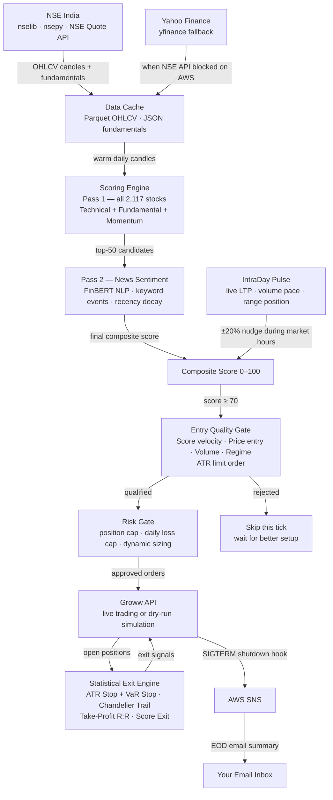
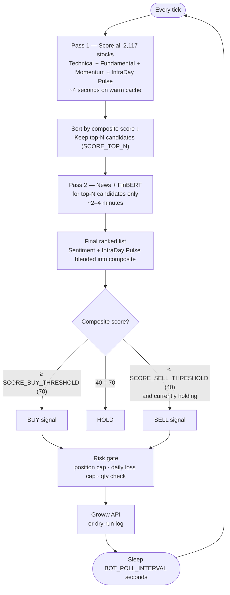
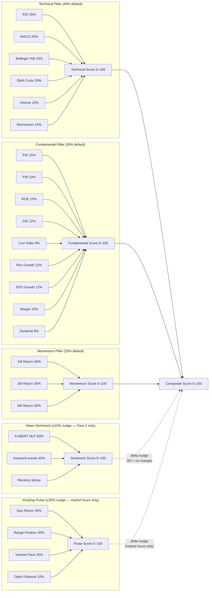
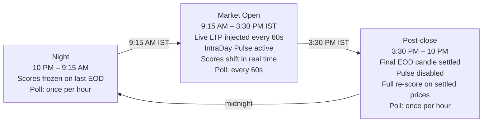

# NSE Algorithmic Trading Bot

A fully automated, score-driven equity trading bot for the Indian stock market (NSE), built on the Groww brokerage API. Every tick, it scores all 2,117 NSE-listed EQ-series stocks across five pillars — technical analysis, fundamental analysis, price momentum, live news sentiment via FinBERT, and an intraday pulse — then applies a statistical entry quality gate before buying, and uses ATR + Value-at-Risk derived exit levels to maximise the profit captured between entry and exit.

---

## Table of Contents

1. [Architecture](#architecture)
2. [Step-by-Step: What Happens on Every Tick](#step-by-step-what-happens-on-every-tick)
3. [How Scoring Works](#how-scoring-works)
4. [Background & Theory](#background--theory)
   - [Why Algorithmic Trading?](#why-algorithmic-trading)
   - [RSI — Relative Strength Index](#rsi--relative-strength-index)
   - [MACD — Moving Average Convergence Divergence](#macd--moving-average-convergence-divergence)
   - [Bollinger Bands](#bollinger-bands)
   - [SMA Crossover — Golden Cross & Death Cross](#sma-crossover--golden-cross--death-cross)
   - [Volume Trend](#volume-trend)
   - [Price Momentum](#price-momentum)
   - [Fundamental Analysis](#fundamental-analysis)
   - [IntraDay Pulse](#intraday-pulse)
   - [News Sentiment — FinBERT](#news-sentiment--finbert)
   - [Composite Score Formula](#composite-score-formula)
5. [Entry Quality — Optimal Entry Timing](#entry-quality--optimal-entry-timing)
   - [Score Velocity & Acceleration](#score-velocity--acceleration)
   - [Price Entry Quality](#price-entry-quality)
   - [Volume Confirmation at Entry](#volume-confirmation-at-entry)
   - [Market Regime Filter](#market-regime-filter)
   - [Bullish Divergence Bypass](#bullish-divergence-bypass)
   - [Optimal Entry Price — ATR Limit Orders](#optimal-entry-price--atr-limit-orders)
   - [Entry Quality Formula](#entry-quality-formula)
6. [Statistical Exit Signals — Maximising Profit](#statistical-exit-signals--maximising-profit)
   - [Why Percentage Stops Are Wrong](#why-percentage-stops-are-wrong)
   - [ATR-Based Stop-Loss](#atr-based-stop-loss)
   - [Historical Value at Risk (VaR)](#historical-value-at-risk-var)
   - [Chandelier Exit — Trailing Stop](#chandelier-exit--trailing-stop)
   - [Take-Profit via Risk:Reward Ratio](#take-profit-via-riskreward-ratio)
   - [Score-Based & Emergency Exits](#score-based--emergency-exits)
   - [Exit Priority Order](#exit-priority-order)
7. [Sector-Specific Tuning](#sector-specific-tuning)
8. [Market Hours Behaviour](#market-hours-behaviour)
9. [Dynamic Position Sizing](#dynamic-position-sizing)
10. [Risk Controls](#risk-controls)
11. [Project Structure](#project-structure)
12. [Setup & Running](#setup--running)
13. [EC2 Deployment](#ec2-deployment)
14. [Full Configuration Reference](#full-configuration-reference)
15. [Customising Your Strategy](#customising-your-strategy)

---

## Architecture



### Component Roles

| Component | What it does |
|-----------|-------------|
| **NSE India (nselib / nsepy)** | Primary source of truth — 2,117 EQ-series symbols, daily OHLCV candles, company fundamentals. If the NSE API returns 403 (common on AWS IPs), the bot automatically falls back to yfinance (Yahoo Finance's NSE mirror). |
| **Data Cache** | Parquet files for OHLCV (one file per symbol, ~1 year of daily candles), JSON files for fundamentals. Only downloads what's stale — cold start takes 5–15 minutes, warm ticks take seconds. |
| **Scoring Engine** | Two-pass scorer. Pass 1 scores all 2,117 stocks using technical + fundamental + momentum — takes about 4 seconds. Pass 2 runs FinBERT news analysis only on the top-50 candidates — takes 2–4 minutes. |
| **IntraDay Pulse** | A fifth pillar, active only when the NSE market is open (09:15–15:30 IST). Uses same-day candle data (day return, range position, volume pace, open distance) to capture whether a stock is rallying or collapsing right now. |
| **Entry Quality Gate** | Before any BUY is placed, six statistical filters are applied: score velocity (is the score rising or falling through the threshold?), price entry quality (RSI, Bollinger %B, distance from ATR support), volume confirmation, market regime, an optional bullish divergence bypass (buy quality dips even in bear markets when relative strength divergence is detected), and an ATR-based limit order for better fill prices. Stocks failing any filter are skipped this tick. |
| **Statistical Exit Engine** | Each held position has dynamically computed exit levels — ATR-based stop-loss, Historical VaR stop, Chandelier trailing stop (LeBeau 1999), and a take-profit at a fixed R:R ratio. No hardcoded percentages — a volatile stock gets a wider stop automatically; a stable stock gets a tighter one. |
| **Risk Gate** | Hard guardrails: max simultaneous holdings, max daily loss, max quantity per order. Dynamic position sizing computes the right share count from your live wallet balance. |
| **Groww API** | Executes real CNC (delivery) orders (MARKET or LIMIT) in live mode, or logs simulated fills in dry-run mode. |
| **AWS SNS** | On shutdown (triggered by EC2 stop → SIGTERM), the bot sends a full EOD summary email — orders placed, realized P&L, open positions, top gainers, top losers. |

---

## Step-by-Step: What Happens on Every Tick

This section walks through the complete lifecycle — from boot to order placement — in detail.

### 1. Bootstrap (once at startup)

When `bot.py` is launched, it first runs the data pipeline to ensure the cache is fresh:

**Universe refresh** — `universe.py` fetches the full list of 2,117 EQ-series NSE symbols from nselib. Each symbol is tagged with a sector (IT, Banking, Pharma, etc.) for sector-specific scoring. The universe list is cached in `cache/universe.json` with a 7-day TTL. If nselib is blocked (AWS IP restriction), the stale cached universe is used as a fallback — the bot never crashes on a cold universe. The `cache/universe.json` file is tracked in git so EC2 always gets a fresh copy via `git pull` on boot.

**OHLCV refresh** — `data/fetcher.py` iterates over all 2,117 symbols and checks each Parquet cache file. If a symbol's data is stale (last candle older than today, excluding weekends and holidays), it fetches the missing candles from nselib. For any symbol where nselib returns an error, nsepy is tried as a second source. If both fail, yfinance is used as a final fallback. This three-tier approach ensures maximum coverage — even stocks with restricted NSE API access get their OHLCV data from Yahoo's NSE mirror.

**Fundamentals refresh** — For each symbol, the bot fetches P/E, P/B, ROE, D/E, revenue growth, EPS growth, profit margin, and dividend yield from the NSE equity quote API. Fundamentals are cached per-symbol as JSON with a weekly TTL (they don't change daily). If the NSE fundamentals endpoint returns 403, the bot falls back to `yfinance Ticker.info` — which successfully populated 1,236 out of 2,117 symbols in testing. Symbols with no available fundamentals score their fundamental pillar at 50 (neutral) and are not penalised.

### 2. The Tick Loop

After bootstrap, the bot enters an infinite loop. The sleep interval adapts to market state:
- **During market hours** (09:15–15:30 IST): `BOT_POLL_INTERVAL_OPEN` (default 60 seconds)
- **Outside market hours**: `BOT_POLL_INTERVAL_CLOSED` (default 3600 seconds)

Market hours are determined by `market_hours.py` using `pandas_market_calendars` with the `NSE` calendar, which includes all NSE trading holidays automatically.

### 3. Pass 1 — Fast Scoring of All 2,117 Stocks (~4 seconds)

The scoring engine iterates over every symbol in the universe. For each stock:

**Load OHLCV** from the Parquet cache. The last 200+ rows of daily candles are loaded into a pandas DataFrame. All indicator computation happens on this DataFrame.

**Inject live candle** — if the market is currently open, the bot fetches the real-time NSE quote for this symbol (live Open, High, Low, LTP, Volume) and appends it as today's row before computing any indicator. This means RSI, MACD, Bollinger Bands, and all other indicators compute on the actual current price, not last night's close. This is what makes the bot genuinely reactive to intraday moves rather than always trading on yesterday's data.

**Technical score** — six sub-indicators are computed on the candle DataFrame: RSI (14-day overbought/oversold), MACD (trend acceleration + crossovers), Bollinger %B (mean reversion positioning), SMA Crossover (long-term trend structure), Volume Trend (confirmation strength), and Price Momentum (1M/3M/6M returns). Each returns a 0–100 score, then they are weighted by `WEIGHT_TECH_*` variables and summed into a single `technical_score`.

**Fundamental score** — the sector-specific fundamental scorer reads the cached JSON and computes a weighted score across all available fundamental metrics. The weights are specific to each sector (e.g., banking uses P/B and ROE heavily; IT uses revenue growth). Missing metrics default to 50 (neutral) so they don't penalise stocks for which data is unavailable.

**Momentum score** — 1-month, 3-month, and 6-month returns are computed directly from the OHLCV candles (no external data needed) and combined with weights 0.5 / 0.3 / 0.2.

**IntraDay Pulse** — if the market is open, a live pulse sub-score (0–100) is computed from today's candle: how much has the stock moved today, where does LTP sit in today's high-low range, and is volume tracking ahead of the session pace. A delta-based formula nudges the composite proportionally — a flat, mid-range stock on average volume gets zero boost.

**Composite score** — technical, fundamental, and momentum scores are combined with sector-specific pillar weights (e.g., Banking: 35%/45%/20%; IT: 45%/30%/25%). The IntraDay Pulse is then blended in. The result is a single 0–100 composite score.

Pass 1 finishes in approximately 4 seconds on a warm Parquet cache for all 2,117 stocks.

### 4. Pass 2 — FinBERT News Sentiment on Top-50 (~2–4 minutes)

The top-50 stocks by composite score from Pass 1 go through a second, slower pass:

**News fetch** — for each of the 50 symbols, RSS feeds are queried from Economic Times Markets, LiveMint, and Google News (symbol + company name query). Articles are cached for `SENTIMENT_CACHE_MINUTES` (default 30) minutes so the same article is not re-analysed on every tick.

**FinBERT inference** — each article's headline and description is passed through the `ProsusAI/finbert` transformer model (a BERT model fine-tuned on SEC filings and financial news), which outputs probabilities for positive, negative, and neutral sentiment. `sentiment_raw = P(positive) − P(negative)` gives a value from −1 to +1.

**Keyword boost** — 60 financial event keywords are scanned across each article. High-conviction positive events ("order win", "record revenue", "dividend declared", "upgrade", "FII buying", "product launch") and negative events ("SEBI notice", "promoter pledge", "earnings miss", "downgrade", "fraud", "NPA") add fixed boosts or penalties that can override or amplify the NLP model score.

**Recency decay** — articles are weighted by age using exponential decay with a configurable half-life. A breaking news article from 30 minutes ago carries far more weight than a 36-hour-old piece. Articles older than `SENTIMENT_MAX_AGE_HOURS` (default 48h) are discarded entirely.

**Sentiment blending** — the final sentiment score (0–100, where 50 = perfectly neutral) is blended into the composite using a delta formula. A neutral score of exactly 50 produces zero delta — no change to the composite. Only meaningful positive or negative news moves the needle.

### 5. Strategy — Entry Quality Gate & Signal Generation

**Score velocity update** — every tick, the composite score for each symbol is appended to a rolling 10-tick history. This history is used immediately in the entry quality gate.

**BUY candidates** — any stock with composite score ≥ `SCORE_BUY_THRESHOLD` (default 70) that the bot doesn't already hold is a candidate. But rather than buying immediately, each candidate is passed through the Entry Quality Gate:

1. **Score velocity check** — the last N scores are fitted with a linear regression. A negative slope means the score is *falling through* the threshold — the stock is declining, not improving. These are rejected outright. Only stocks with a rising or flat-rising score progress. Positive acceleration (the slope itself is increasing) gets a quality bonus.

2. **Price entry quality** — three sub-indicators check whether the current price is a good entry point: RSI (ideally below 55 — not overbought at the moment of entry), Bollinger %B (ideally below 0.55 — buying near the lower half of the band, not extended), and distance from ATR-based support (closer to SMA20 = more upside available). A stock scoring 74 but already up 6% on the day with RSI=72 is a poor entry — too late, too little room left.

3. **Volume confirmation** — if today's volume is below `ENTRY_VOL_MIN_RATIO` (default 80%) of the 20-day average, the signal is rejected. Thin-volume moves lack institutional conviction and are more likely to reverse. The volume *trend* over the last 5 days also contributes — rising volume is a positive signal.

4. **Market regime** — the fraction of all 2,117 NSE stocks with composite score > 50 is computed in real time. If fewer than `ENTRY_BULL_RATIO_MIN` (default 40%) of the market is bullish, the regime filter normally blocks all new BUY signals. However, the **Bullish Divergence Bypass** can override this for stocks showing exceptional relative strength (see below).

5. **Bullish divergence bypass** — when the market is in a bear regime but a stock simultaneously satisfies all three conditions: composite score ≥ `ENTRY_REGIME_BYPASS_MIN_SCORE` (default 78), score velocity ≥ `ENTRY_REGIME_BYPASS_MIN_VELOCITY` (default 1.5 pts/tick), and RSI ≤ `ENTRY_REGIME_BYPASS_MAX_RSI` (default 45), the regime block is lifted for that stock alone. This is the classic O'Neil relative strength signal — the stock's fundamentals are improving while the market deteriorates, and the price is already beaten down. These buys always use LIMIT orders with a 1.5× enhanced pullback to minimise risk in the weak environment.

6. **Composite entry quality score** — velocity, price, volume, and regime sub-scores are weighted into a single 0–100 quality index. If the index is below `ENTRY_MIN_QUALITY` (default 55), the signal is skipped this tick and re-evaluated next tick. Note: divergence bypass buys cap the regime_score at 30 to keep the quality score honest — the market risk is real even if the stock looks good.

7. **Optimal entry price** — if quality is high (≥ 80), a MARKET order is placed immediately. For medium quality (55–80), a LIMIT order is placed at `ltp − entry_pullback_mult × ATR`. Divergence bypass buys always use LIMIT at `ltp − 1.5 × entry_pullback_mult × ATR`. Small intraday pullbacks occur frequently; catching one gives a better fill price, which directly increases the profit margin. If the limit is not filled within `ENTRY_LIMIT_TIMEOUT_TICKS` (default 3 ticks), it is cancelled and a market order is placed instead.

**SELL logic** — for every held position, the statistical exit engine evaluates five conditions on every tick (see the Statistical Exit Signals section for full detail). Score < threshold alone never triggers a sell at a loss.

**Quantity calculation** — for each BUY signal, `compute_quantity()` is called. In dynamic sizing mode, it fetches the live CNC balance from Groww, multiplies by `RISK_DEPLOY_FRACTION` (default 90%), divides by the number of remaining open slots to spread capital evenly, then divides by the live LTP to get the number of shares. In dry-run mode, `RISK_DRY_RUN_BALANCE` is used instead of the real wallet.

### 6. Order Placement

Approved signals are submitted to Groww's API as CNC (delivery) orders. The order ID is stored locally. On the next tick, `sync_pending_orders()` polls Groww for fill status — filled orders update the in-memory position tracker and P&L; rejected orders are cleared so the bot can retry next tick.

### 7. Shutdown & EOD Email

When the EC2 instance is stopped by EventBridge (or the bot receives SIGTERM for any reason), Python's `finally` block fires `_shutdown()`. This collects the day's complete order history, total realized P&L, all open positions, and all positions touched this session (for top gainer/loser ranking). It then publishes a structured summary to AWS SNS, which emails it to your inbox within seconds.

---

## How Scoring Works



### The Five Scoring Pillars



---

## Background & Theory

### Why Algorithmic Trading?

The fundamental case for algorithmic trading rests on three pillars: human psychology, computational scale, and speed.

Human traders are demonstrably irrational. Daniel Kahneman's Nobel Prize-winning research on behavioural economics (2002) catalogued dozens of systematic cognitive biases that cause traders to consistently lose money — **loss aversion** (losses feel twice as painful as equivalent gains feel good, causing traders to hold losers too long hoping for recovery), **anchoring** (fixating on a purchase price when making sell decisions, even when it's irrelevant), **recency bias** (overweighting the last few days' price action), and the **disposition effect** (selling winners too early to "lock in" gains while letting losers ride). A rules-based algorithm has none of these biases. It sells when the score says sell, regardless of what you paid.

The second pillar is scale. A human analyst can meaningfully track perhaps 20–30 stocks at a time. This bot evaluates all 2,117 NSE-listed EQ-series stocks every single tick — the same rigour, the same criteria, applied uniformly. No stock is overlooked because the analyst was tired, distracted, or unfamiliar with that sector.

The third pillar is speed. The bot re-scores every stock every 60 seconds during market hours. A human analyst reading news and checking charts might revisit a watchlist stock every few hours. By the time they notice a breakout or a FinBERT-flagged negative news event, the opportunity (or the danger) may have already passed.

This bot combines two historically validated schools of market analysis — technical analysis (the price itself contains predictive information) and fundamental analysis (business quality determines long-term value) — and augments them with a modern third layer: natural language processing on live financial news.

---

## Technical Indicators

All computed from daily OHLCV using pure pandas — no TA library dependency.

### RSI — Relative Strength Index

**Origin and history:** J. Welles Wilder Jr. introduced RSI in his 1978 book *New Concepts in Technical Trading Systems*. Wilder was a mechanical engineer and real estate trader who turned to commodity futures in the 1970s. Frustrated by the inability of existing trend-following indicators to identify exhausted moves, he developed RSI to measure not direction, but the *velocity* of price changes. The indicator became one of the most widely reproduced tools in all of technical analysis within a decade of its publication, adopted by equity, forex, and commodity traders globally.

**What it measures:** The ratio of average gains to average losses over a 14-day window. When a stock has been rising sharply for 14 consecutive days, RSI approaches 100. When it has been falling, it approaches 0. The "overbought" and "oversold" labels capture Wilder's original insight: after a sustained directional run, the market tends to revert — buyers become exhausted, and sellers take over.

```
avg_gain = Wilder-smoothed EMA of daily upward price changes (14-period)
avg_loss = Wilder-smoothed EMA of daily downward price changes (14-period)
RS       = avg_gain / avg_loss
RSI      = 100 − (100 / (1 + RS))

RSI < 30  → oversold  → sustained selling has exhausted → mean reversion expected → bullish
RSI > 70  → overbought → sustained buying has exhausted → pullback expected → bearish
RSI ≈ 50  → neutral momentum
```

**Scoring mapping:** RSI 20 → score 95. RSI 30 → score 80. RSI 50 → score 50. RSI 70 → score 20. RSI 80 → score 5. Non-linear curve to weight the extremes most heavily.

**Weight in Technical pillar:** 15% (`WEIGHT_TECH_RSI`)

---

### MACD — Moving Average Convergence Divergence

**Origin and history:** Gerald Appel developed MACD in the late 1970s while managing money in New York and writing his newsletter *Systems and Forecasts*. Appel was searching for a way to capture not just whether prices were trending but whether that trend was strengthening or weakening. His key innovation was the "signal line" — an EMA of the MACD itself — which transformed a simple momentum measure into a crossover system. Thomas Aspray added the histogram in 1986, making it visually obvious when momentum was accelerating or decelerating. MACD became the dominant trend indicator of the 1980s and 1990s and remains among the most widely used indicators globally.

**What it measures:** The gap between a fast exponential moving average (12-day) and a slow exponential moving average (26-day). When the fast EMA is above the slow EMA, recent price action is stronger than the longer-term trend — bullish. The histogram (MACD minus the signal line) shows whether this gap is widening (momentum accelerating) or narrowing (momentum fading). A crossover — when MACD crosses its signal line — is the classic buy/sell trigger.

```
MACD      = EMA(Close, 12) − EMA(Close, 26)
Signal    = EMA(MACD, 9)
Histogram = MACD − Signal

Growing positive histogram → bullish acceleration → score increases
Shrinking positive histogram → bullish but weakening → score decreases
MACD crossing above Signal (bullish crossover) → score spike
MACD crossing below Signal (bearish crossover) → score drop
```

**Scoring:** Based on histogram direction and magnitude (normalised to the stock's recent ATR), plus whether a crossover occurred in the last 3 days.

**Weight in Technical pillar:** 20% (`WEIGHT_TECH_MACD`) — the highest weight, reflecting MACD's reliability as a trend confirmation tool.

---

### Bollinger Bands

**Origin and history:** John Bollinger developed Bollinger Bands in the early 1980s while working as a financial analyst and appearing on Financial News Network (now CNBC). He was troubled that existing volatility measures were static — they didn't adapt to changing market conditions. His innovation was using the standard deviation of prices (not a fixed percentage) to set band width, so bands automatically expand in volatile markets and contract in quiet ones. He formally described the technique in his 2001 book *Bollinger on Bollinger Bands*, and the indicator now appears in virtually every charting platform worldwide. The %B indicator — measuring where price sits within the band — was Bollinger's own addition to translate the visual band into a numerical signal.

**What it measures:** A 20-day simple moving average with bands placed exactly 2 standard deviations above and below. By definition, approximately 95% of daily closes fall inside the bands. When price touches or breaches the lower band, it is statistically unusual — the stock has moved 2 standard deviations below its recent average. Mean reversion theory (and substantial empirical evidence) suggests this is a bullish entry point.

```
SMA_20  = Rolling mean(Close, 20)
STD_20  = Rolling std(Close, 20)
Upper   = SMA_20 + 2 × STD_20
Lower   = SMA_20 − 2 × STD_20
%B      = (Close − Lower) / (Upper − Lower)

%B < 0.2 → price near lower band → statistically oversold → bullish mean-reversion signal
%B > 0.8 → price near upper band → statistically overbought → bearish signal
%B = 0.5 → price at midband (20-day average) → neutral
```

**The Bollinger Squeeze:** A period where the bands become very narrow (low standard deviation) indicates a compression of volatility. Bollinger identified this as a reliable precursor to a large directional move — though the direction cannot be predicted from the squeeze alone. The bot uses this information combined with MACD direction to interpret which way the squeeze will resolve.

**Scoring:** %B 0.0 → score 95. %B 0.2 → score 75. %B 0.5 → score 50. %B 0.8 → score 25. %B 1.0 → score 5.

**Weight in Technical pillar:** 15% (`WEIGHT_TECH_BOLLINGER`)

---

### SMA Crossover — Golden Cross & Death Cross

**Origin and history:** The concept of comparing moving averages dates to Charles Dow's original Dow Theory in the late 1800s, which described primary and secondary market trends. The specific 50-day / 200-day crossover became standard practice in the mid-20th century as computing became accessible to financial analysts. The terms "Golden Cross" and "Death Cross" entered market vernacular in the 1960s and 1970s. The first rigorous academic validation came from Brock, Lakonishok, and LeBaron in their landmark 1992 *Journal of Finance* paper, which found that simple moving average rules produced statistically significant excess returns in US equity markets over 90 years of data — a finding that surprised an academic community then dominated by efficient market theory. Subsequent studies found similar results in European, Asian, and emerging markets including India.

**What it measures:** The structural long-term trend of a stock. When the 50-day simple moving average crosses above the 200-day SMA, the stock's medium-term behaviour has shifted from bearish to bullish — what chartists call a "Golden Cross." When it crosses below, the "Death Cross" signals the transition from bull to bear trend. The 50/200 pairing is significant: 50 days captures one quarter of business activity; 200 days captures an entire trading year.

```
Full bull alignment:  Price > SMA50 > SMA200          → score 100  (all three in bull formation)
Golden Cross:         SMA50 just crossed above SMA200  → score 90   (major trend change signal)
Bull, partial:        SMA50 > SMA200, Price < SMA50    → score 60   (trend bullish, price pullback)
Neutral:              Mixed alignment                   → score 50
Bear, partial:        SMA50 < SMA200, Price > SMA50    → score 40   (trend bearish, price bounce)
Death Cross:          SMA50 just crossed below SMA200  → score 10   (major bearish signal)
Full bear alignment:  Price < SMA50 < SMA200           → score 0    (all three in bear formation)
```

Crossovers in the last 5 days receive an additional score boost/penalty to capture the timeliness of the signal.

**Weight in Technical pillar:** 20% (`WEIGHT_TECH_SMA_CROSS`) — equal to MACD, reflecting the importance of long-term trend structure.

---

### Volume Trend

**Origin and history:** Joseph Granville introduced the On-Balance Volume (OBV) concept in his 1963 book *Granville's New Key to Stock Market Profits*, with the famous maxim: "Volume is the steam that makes the choo-choo go." Granville's central insight was that institutional investors — who move markets — cannot buy or sell large positions without leaving a footprint in volume data. They accumulate quietly over weeks or months, with rising volume on up-days and falling volume on down-days, before a price move becomes visible. Retail investors, who move last, pile in on high volume *after* the move has already happened. By tracking whether volume is confirming price moves, the bot can distinguish between conviction-backed breakouts and low-volume head fakes.

**What it measures:** Whether today's volume is significantly above or below its 20-day moving average. High volume confirms that institutional money is behind a move; low volume suggests the move lacks conviction and may reverse.

```
vol_ratio = Volume_today / Volume_20day_avg

vol_ratio > 2.0 → massive volume spike → score 90  (institutional activity; strong confirmation)
vol_ratio > 1.5 → elevated volume     → score 75
vol_ratio > 1.0 → above average       → score 60  (healthy participation)
vol_ratio > 0.7 → slightly below avg  → score 45
vol_ratio < 0.5 → volume drying up    → score 25  (weak, unconfirmed move — high reversal risk)
```

**Important note:** Volume alone is not directional. A massive volume spike on a down-day is bearish. The bot combines this sub-score with directional indicators (MACD, SMA) to interpret it correctly. A low volume score on an up-day reduces confidence in the move; a low volume score on a down-day may signal the sell-off is exhausted.

**Weight in Technical pillar:** 15% (`WEIGHT_TECH_VOLUME`)

---

### Price Momentum

**Origin and history:** Narasimhan Jegadeesh and Sheridan Titman published the most important paper in momentum research in the *Journal of Finance* in 1993: "Returns to Buying Winners and Selling Losers: Implications for Stock Market Efficiency." They showed that stocks with the highest 3–12 month returns continued to outperform over the next 3–12 months, and the worst performers continued to underperform — a finding directly contradicting the efficient market hypothesis. The momentum effect has since been replicated in virtually every equity market studied, including NSE. Clifford Asness and AQR Capital codified it as one of the four canonical factors in quantitative asset management (alongside value, size, and quality). The mechanism is partly behavioural (investors underreact to fundamental news, causing gradual price discovery) and partly structural (trend-following algorithms self-reinforce trends once established).

**What it measures:** The stock's own price return over three lookback windows, capturing whether it has been persistently trending upward or downward. The three windows capture different trend horizons: 1 month shows near-term momentum, 3 months shows medium-term trend, 6 months shows the established structural trend.

```
return_1m = (Close_today − Close_20d_ago)  / Close_20d_ago  × 100
return_3m = (Close_today − Close_60d_ago)  / Close_60d_ago  × 100
return_6m = (Close_today − Close_120d_ago) / Close_120d_ago × 100

momentum_score = 0.5 × score(return_1m)    ← 1-month weighted highest (most predictive near-term)
               + 0.3 × score(return_3m)
               + 0.2 × score(return_6m)
```

**Scoring:** Each return is normalised relative to typical NSE distribution. A +10% 1-month return scores approximately 80. A −10% return scores approximately 20. Returns beyond ±20% are clipped to avoid extreme outliers dominating the score.

**Weight:** Forms its own pillar (25% of composite by default, configurable per sector). Also contributes 15% within the Technical pillar as a sub-indicator.

---

## Fundamental Analysis

Fundamental data is fetched weekly from NSE's equity quote API and cached per-symbol as JSON. If the NSE API returns 403 (common on AWS IPs), `yfinance Ticker.info` provides the same data from Yahoo Finance's NSE mirror. If no fundamental data is available for a symbol, the fundamental pillar scores 50 (neutral) — the bot continues trading on technicals and momentum alone for that symbol, without penalising it for data unavailability.

**Why fundamentals matter for a trading bot:** Benjamin Graham's *Security Analysis* (1934) and *The Intelligent Investor* (1949) established that stock prices oscillate around an intrinsic value determined by business performance. Over long horizons, price always converges to value. Over shorter horizons — which is where this bot operates — fundamentals act as a quality filter. A technically bullish signal (RSI oversold + MACD crossover) on a deeply overvalued, debt-ridden company with shrinking margins is far less trustworthy than the identical signal on a high-ROE, debt-free business growing at 20% annually and trading at a reasonable P/E. Fundamentals don't drive short-term price moves — but they determine which technical setups are worth trusting.

| Metric | Formula | What it captures | Scoring direction |
|--------|---------|-----------------|------------------|
| **P/E** | Price / EPS (trailing 12m) | Earnings valuation — how much you pay per rupee of profit | Lower = better (cheaper) |
| **P/B** | Price / Book Value per share | Asset valuation — critical for capital-heavy sectors | Lower = better |
| **ROE** | Net Income / Shareholders' Equity × 100 | Capital efficiency — Warren Buffett's primary screening metric | Higher = better |
| **D/E** | Total Debt / Total Equity | Financial leverage and long-term solvency risk | Lower = safer |
| **Current Ratio** | Current Assets / Current Liabilities | Short-term liquidity — can the company pay near-term bills? | > 1.5 = healthy |
| **Revenue Growth** | (Revenue_now − Revenue_prev) / Revenue_prev | Top-line business expansion (YoY) | Higher = better |
| **EPS Growth** | (EPS_now − EPS_prev) / EPS_prev | Bottom-line earnings expansion — net of cost increases | Higher = better |
| **Profit Margin** | Net Income / Revenue × 100 | Pricing power and operational efficiency | Higher = better |
| **Dividend Yield** | Annual Dividend / Price × 100 | Income signal + management confidence in sustainable cash flow | Context-dependent by sector |

---

## IntraDay Pulse

**What it is:** A live intraday scoring pillar, active only when the NSE market is open (09:15–15:30 IST). It uses fresh same-day candle data — fetched on every tick — to capture whether a stock is behaving bullishly *right now*, not just based on its historical multi-day patterns. After market close, the IntraDay Pulse is completely disabled, and scores reflect only structural quality from historical candles.

**The motivation:** Consider two stocks, both with a composite score of 68 at 10:00 AM. Stock A is up 2.8% on the day on 180% of average volume, trading near the top of its daily range. Stock B is flat on the day with thin volume. Without the IntraDay Pulse, they score identically. With it, Stock A gets nudged to ~74 (a BUY signal), while Stock B stays at 68. The pulse captures this distinction.

**Four components:**

| Component | Weight | What it measures | Scoring |
|-----------|--------|-----------------|---------|
| **Day Return** | 35% (`INTRADAY_W_DAY_RETURN`) | Today's % return vs yesterday's close. ±3% maps to 0–100. | +3% → 100; flat → 50; −3% → 0 |
| **Range Position** | 30% (`INTRADAY_W_RANGE_POSITION`) | Where LTP sits between today's intraday High and Low | At High → 100; at Low → 0; midrange → 50 |
| **Volume Pace** | 25% (`INTRADAY_W_VOLUME_PACE`) | Today's cumulative volume vs expected (20d avg × session fraction elapsed) | 2× expected → 100; on-pace → 50; low → 0 |
| **Open Distance** | 10% (`INTRADAY_W_OPEN_DISTANCE`) | Distance of LTP from today's opening price. ±2% maps to 0–100. | Above open → bullish nudge |

**Blending formula — delta-based, same as sentiment:**
```
pulse_score  = weighted sum of 4 components (0–100)
delta        = (pulse_score − 50) / 50          # −1.0 to +1.0
boost        = delta × INTRADAY_PULSE_WEIGHT × base_score
final_score  = base_score + boost

Key property: pulse=50 (flat day, mid-range, exactly on-pace volume) → delta=0 → boost=0 → unchanged.
Only stocks actively rallying or collapsing get a meaningful nudge.
```

---

## News Sentiment — FinBERT

### Why not VADER or generic BERT?

VADER (Valence Aware Dictionary and sEntiment Reasoner, developed at Georgia Tech, 2014) is a rule-based lexicon-based sentiment tool. It performs well on social media and general English text but systematically fails on financial language. The phrase "beat estimates by a wide margin" — deeply positive in financial context — scores neutral in VADER because "beat" and "margin" carry no strong valence in its general dictionary. "Downgraded to neutral" — deeply negative for a stock investor — also scores neutral. "The company reported record losses" scores slightly negative when it should score very negative. Financial language is a specialised register with domain-specific meaning, and general-purpose NLP tools are not calibrated for it.

FinBERT (Yi Yang et al., 2020, ProsusAI/finbert) is a BERT-base model fine-tuned on three large financial text corpora: SEC 10-K and 10-Q filings, analyst reports, and Bloomberg financial news articles. It achieves state-of-the-art F1 scores on the Financial PhraseBank benchmark and correctly interprets domain-specific constructions that VADER and generic BERT models miss. Using FinBERT adds approximately 2–4 minutes to each tick (for the top-50 pass) — a deliberate design trade-off. The bot runs FinBERT *only* on the top-50 candidates from Pass 1, not on all 2,117 stocks, to keep the total tick time within a reasonable window.

### How the sentiment pipeline works

```
For each of the top-50 stocks from Pass 1:

Step 1 — Fetch articles from RSS feeds:
  ├── Economic Times (ET Markets RSS)
  ├── LiveMint (Markets RSS)
  └── Google News (query: "<SYMBOL> NSE" + "<Company Name> stock")
  Articles cached for SENTIMENT_CACHE_MINUTES (default 30 min)

Step 2 — For each article (headline + description):
  ├── FinBERT → P(positive), P(negative), P(neutral)
  ├── sentiment_raw   = P(positive) − P(negative)       → −1.0 to +1.0
  ├── keyword_scan    → scan 60 financial domain keywords:
  │     POSITIVE: "order win", "record revenue", "dividend declared",
  │               "buyback", "upgrade", "FII buying", "product launch",
  │               "USFDA approval", "merger synergies", "debt free"...
  │     NEGATIVE: "SEBI notice", "promoter pledge", "earnings miss",
  │               "downgrade", "FII selling", "fraud", "NPA",
  │               "insolvency", "promoter selling", "profit warning"...
  ├── keyword_delta   → adds fixed boost/penalty when keyword matched
  │   blended: final_raw = (1 − SENTIMENT_KEYWORD_WEIGHT) × finbert_raw
  │                      + SENTIMENT_KEYWORD_WEIGHT × keyword_raw
  └── recency_weight  = exp(−SENTIMENT_RECENCY_DECAY × article_age_hours)

Step 3 — Weighted average across all articles:
  → raw_sentiment −1.0 to +1.0
  → normalised to 0–100  (−1 → 0, 0 → 50, +1 → 100)

Step 4 — Minimum article gate:
  If fewer than SENTIMENT_MIN_ARTICLES (default 2) found → return 50 (neutral)
  (No news should never penalise a fundamentally strong stock)

Step 5 — Blend into composite (delta formula):
  delta = (sentiment_score − 50) / 50          # −1.0 to +1.0
  boost = delta × SENTIMENT_COMPOSITE_WEIGHT × base_score
  final = base_score + boost
  final = clip(final, 0, 100)
```

### Key property: neutral news = exactly zero effect

```
Sentiment = 50 (no articles, or all neutral articles)
delta     = (50 − 50) / 50 = 0.0
boost     = 0.0 × anything = 0
final     = base_score  ← completely unchanged ✓

Sentiment = 80 (positive: earnings beat + analyst upgrade)
delta     = (80 − 50) / 50 = 0.60
boost     = 0.60 × 0.15 × 68 = +6.1 pts   (on a base of 68)
final     = 74.1  → crosses BUY threshold of 70 ✓

Sentiment = 20 (negative: SEBI notice + promoter pledge)
delta     = (20 − 50) / 50 = −0.60
boost     = −0.60 × 0.15 × 68 = −6.1 pts
final     = 61.9  → drops out of BUY zone into HOLD ✓
```

---

## Composite Score Formula

```
Step 1 — Three-pillar weighted composite:

  Composite =   (Technical_score   × w_technical)
              + (Fundamental_score × w_fundamental)
              + (Momentum_score    × w_momentum)

  Weights are sector-specific (see Sector-Specific Tuning section).
  All scores and weights are in the range [0, 1] and [0, 100] respectively.

Step 2 — IntraDay Pulse nudge (only during 09:15–15:30 IST):

  delta_pulse = (pulse_score − 50) / 50            # −1.0 to +1.0
  Composite  += delta_pulse × INTRADAY_PULSE_WEIGHT × Composite

Step 3 — News Sentiment nudge (only for top-N stocks in Pass 2):

  delta_sent  = (sentiment_score − 50) / 50        # −1.0 to +1.0
  Final       = Composite + delta_sent × SENTIMENT_COMPOSITE_WEIGHT × Composite

Step 4 — Clip to [0, 100]
```

**Signal thresholds:**

| Composite Score | Signal | What it means |
|----------------|--------|--------------|
| ≥ `SCORE_BUY_THRESHOLD` (default 70) | **BUY** | Strong multi-factor alignment — technical setup confirmed by fundamentals and/or news |
| `SCORE_SELL_THRESHOLD` to `SCORE_BUY_THRESHOLD` (40–70) | **HOLD** | Mixed signals — not strong enough to buy, not weak enough to exit existing position |
| < `SCORE_SELL_THRESHOLD` (default 40, while holding) | **SELL** | Deteriorating setup — cut the position |

---

## Entry Quality — Optimal Entry Timing

The core problem with a naive "score ≥ 70 → buy at market" rule is that it ignores *when* in a move you are entering. Consider two stocks both scoring 74:

- **Stock A:** scores were `[60, 64, 68, 71, 74]` — rising steadily. You are entering early in a developing move. The full upside is still ahead.
- **Stock B:** scores were `[88, 84, 80, 76, 74]` — falling. You are buying a stock that was great two ticks ago but is now deteriorating. The score may cross the sell threshold on the next tick.

The entry quality system filters these cases apart using five statistical methods before any BUY signal is generated.

### Score Velocity & Acceleration

**Origin:** Jegadeesh & Titman's momentum research (1993) showed that not just the level of performance but the *change* in performance predicts near-term continuation. A stock improving on multiple dimensions simultaneously (score accelerating upward) is in a regime transition — the kind of move that produces the largest entry-to-exit profit windows.

**Method:** The last N composite scores for a symbol are fitted with a linear regression (ordinary least squares). The slope is the velocity — score points per tick. A second-order polynomial fit gives the acceleration — whether the velocity itself is increasing.

```
score_history = [60, 64, 68, 71, 74]    (5 ticks)
x             = [0, 1, 2, 3, 4]

linear fit:     score(t) = 3.5t + 59.0
velocity        = +3.5 pts/tick  ✓ (rising)

quad fit:       score(t) = 0.1t² + 3.3t + 59.2
acceleration    = +0.2  ✓ (velocity itself increasing = accelerating improvement)
```

A negative velocity (score is falling) causes the entry to be **rejected outright**, regardless of the current score level. A score of 74 falling from 88 is not a buy — it is an exit from an old signal.

**Scoring:** Velocity maps from 0 pts/tick (score 50) to +5 pts/tick (score 100). Positive acceleration adds a bonus; deceleration penalises.

---

### Price Entry Quality

**Origin:** John Bollinger and Welles Wilder both emphasised that *where* you enter within a move is as important as *identifying* the move. Buying an overbought stock near the top of its Bollinger Bands leaves minimal room to the take-profit target. Buying an oversold stock near the lower band maximises the available upside before the exit is triggered.

**Method:** Three sub-indicators assess the current price's entry quality:

**RSI at entry:** An RSI below 50 at the moment of entry means the stock is temporarily oversold while its composite score is improving — the ideal combination. You are buying weakness on a structurally strong setup.
```
RSI ≤ 40 (deeply oversold + high score) → entry_rsi_score = 100  ← best possible entry
RSI 40–55 (mildly oversold)             → entry_rsi_score = 70–100
RSI 55–70 (neutral to extended)         → entry_rsi_score = 0–70
RSI > 70  (overbought — chasing)        → entry_rsi_score = 0    ← reject
```

**Bollinger %B at entry:** Buying near the lower Bollinger band means the stock is statistically cheap relative to its own recent volatility. There is more room to the upper band (mean reversion upside) than if you buy at the midpoint or upper band.
```
%B ≤ 0.20 (near lower band) → bb_score = 100
%B ≤ 0.55 (below midband)   → bb_score = 60–100
%B > 0.55 (extended)        → bb_score falling → 0 near upper band
```

**Distance from ATR support:** The current price's distance from the 20-day SMA, normalised by ATR.
```
At or below SMA20           → score = 100  (buying near natural support)
1 ATR above SMA20           → score = 60
2 ATRs above SMA20          → score = 20   (extended, risky entry)
3+ ATRs above SMA20         → score = 0    (chasing)
```

---

### Volume Confirmation at Entry

**Origin:** Richard Wyckoff's *Stock Market Technique* (1931) described the "composite operator" — the aggregate of institutional investors. Wyckoff showed that genuine accumulation occurs on expanding volume; moves on thin volume are traps. Joseph Granville formalised this as OBV (1963): volume precedes price.

**Method:** If today's volume is below `ENTRY_VOL_MIN_RATIO` (default 80%) of the 20-day average, the entry is rejected regardless of score. A low-volume price move lacks the institutional backing needed to sustain the trend.

```
vol_ratio < 0.80            → reject (ghost move — likely to reverse)
vol_ratio 1.0               → volume_score = 60  (on-pace)
vol_ratio 2.0               → volume_score = 100 (institutional surge)
vol_trend rising (5d slope) → +10 bonus
```

---

### Market Regime Filter

**Origin:** Mebane Faber's 2007 paper *A Quantitative Approach to Tactical Asset Allocation* (Journal of Investment Management) showed that a simple rule — only buy when the asset's price is above its 10-month SMA — eliminated most bear market losses across five asset classes and 100+ years of data. Lo & MacKinlay (1988) documented that stock returns have positive autocorrelation at short horizons — regimes persist.

**Method:** Rather than fetching a separate index time series, the bot uses the current tick's already-computed universe scores as a real-time regime indicator. The `bull_ratio` — the fraction of all 2,117 NSE stocks with composite score > 50 — is a sensitive, live proxy for broad market health.

```
bull_ratio < 0.40  → broad bear market → reject ALL new BUY signals this tick
bull_ratio 0.50    → regime_score = 40  (cautious)
bull_ratio 0.55    → regime_score = 60  (healthy)
bull_ratio 0.65+   → regime_score = 100 (strong bull participation)
```

This filter alone prevents the most destructive scenario: buying individual stocks during a broad market correction. When 60%+ of NSE stocks are deteriorating, the smartest action is usually no new entries.

---

### Bullish Divergence Bypass

**The core question:** if the market is in a bear phase and most stocks are falling, but one stock has a very high score, a rising score velocity, and an oversold price — should you buy it?

**The answer: yes, but only under very strict conditions, and only with a limit order.**

**Origin — William O'Neil's Relative Strength (1988):** O'Neil spent decades studying the greatest stock market winners from 1880 to the 1980s. His single most consistent finding, codified in his CAN SLIM methodology, was the **Relative Strength (RS) rating**: stocks that outperform the broad market during a market decline are almost always the first to make new highs when the market recovers. The reason is structural — if a company's earnings are accelerating, institutional fund managers keep buying regardless of the macro environment. Their buying pressure shows up as the stock holding up (or even rising) while everything else falls. You are, in effect, front-running the next bull market leader.

**Stan Weinstein's Stage Analysis (1988):** Weinstein described four distinct stages every stock goes through: Stage 1 (base), Stage 2 (markup), Stage 3 (top), Stage 4 (decline). His key observation was that a stock entering Stage 2 from a Stage 1 base often does so while the broad market is still in Stage 4 — the stock completes its bottom and begins rallying *before* the market recovers. Waiting for the market to become bullish (bull_ratio ≥ 40%) before buying such a stock means missing the first 10–20% of the move.

**Why three conditions must all hold simultaneously:**

| Condition | What it confirms | What fails without it |
|-----------|-----------------|----------------------|
| `score ≥ ENTRY_REGIME_BYPASS_MIN_SCORE` (≥78) | Fundamentals AND technicals are structurally excellent — this is not a mediocre stock that happens to have an improving score | A score of 70 barely above threshold in a bear market has high reversal risk |
| `velocity ≥ ENTRY_REGIME_BYPASS_MIN_VELOCITY` (≥1.5 pts/tick) | The score is actively *rising* through the bear market — institutional accumulation is ongoing | A stock with a flat score just happens to be above the threshold; it is not diverging |
| `RSI ≤ ENTRY_REGIME_BYPASS_MAX_RSI` (≤45) | The price has already been beaten down — you are buying a temporarily depressed price on a structurally improving stock | If RSI is 62 and score is rising, the price has already recovered; you're chasing, not dipping |

**What this looks like in practice:**

```
Bear market scenario:  bull_ratio = 13%  (87% of NSE stocks scoring poorly)

Stock X:  composite = 82.3  velocity = +2.1 pts/tick  RSI = 38
  → All three bypass conditions met
  → ⚡ DIVERGENCE BYPASS — LIMIT order placed at: ltp − 1.5 × ATR
  → regime_score capped at 30 (honest about market risk)
  → quality_score = 62.4/100 (qualifies; lower than a bull market entry)

Stock Y:  composite = 76.1  velocity = +1.8 pts/tick  RSI = 52
  → Score and velocity ok, but RSI = 52 > 45 (price not oversold)
  → No bypass — BUY skipped: unfavourable regime + RSI=52 > 45

Stock Z:  composite = 80.5  velocity = +0.8 pts/tick  RSI = 39
  → Score and RSI ok, but velocity = 0.8 < 1.5 (not rising fast enough)
  → No bypass — BUY skipped: unfavourable regime + vel=0.8 < 1.5
```

**Risk management on divergence buys:**
- Always LIMIT order, never MARKET — never chase even a good stock in a weak market
- Pullback is 1.5× the normal ATR pullback — secures a better entry price as the stock may dip further
- The `regime_score` is hard-capped at 30/100 regardless of how good the stock looks — the overall quality score stays honest and reflects real market risk
- Normal ATR stop-loss, VaR stop, and Chandelier exit apply — divergence does not relax exit controls

**Configure the bypass thresholds:**

```env
ENTRY_REGIME_BYPASS_MIN_SCORE=78       # raise to 82+ for stricter selectivity
ENTRY_REGIME_BYPASS_MIN_VELOCITY=1.5   # raise to 2.0 for only very fast risers
ENTRY_REGIME_BYPASS_MAX_RSI=45         # lower to 40 for only deeply oversold stocks
```

To **disable** the bypass entirely (only buy in bull markets), set an impossibly high score threshold:
```env
ENTRY_REGIME_BYPASS_MIN_SCORE=200      # no stock can score above 100; bypass never fires
```

---

### Optimal Entry Price — ATR Limit Orders

**Origin:** Van Tharp's *Trade Your Way to Financial Freedom* (1998) introduced the concept of R — the risk per trade, defined as the distance from entry to stop-loss in rupees. Van Tharp's key insight: **R is determined entirely by entry price**. If the stop-loss is at ₹1,580 and you enter at ₹1,600, R = ₹20. If you enter at ₹1,592 (a small pullback), R = ₹12 — but your take-profit is also further away in R multiples, so you realise a larger profit on the same setup.

**Method:** After a candidate passes all four quality filters, the entry price is determined by the composite quality score:

```
Quality ≥ 80  → MARKET order immediately
              (high conviction — don't risk missing a strong breakout)

Quality 55–80 → LIMIT order at: ltp − quality_factor × entry_pullback_mult × ATR
              quality_factor = 1.0 at quality=55, 0.0 at quality=80
              (scale back the pullback target as quality improves)

If the LIMIT is not filled within entry_limit_timeout_ticks → cancel, enter at MARKET
```

Small intraday pullbacks of 0.3–1.0 ATR occur on the majority of qualifying setups. When the limit fills, the effective stop distance is the same in ₹ but the take-profit is now further away — every rupee saved at entry is a rupee of additional profit at exit.

---

### Entry Quality Formula

```
entry_quality =
    ENTRY_W_VELOCITY × velocity_score      (0.30)
  + ENTRY_W_PRICE    × price_score         (0.35)   ← highest weight: price matters most
  + ENTRY_W_VOLUME   × volume_score        (0.15)
  + ENTRY_W_REGIME   × regime_score        (0.20)

All sub-scores are 0–100.
entry_quality < ENTRY_MIN_QUALITY (55) → skip this tick
```

**Example — same score, very different entry quality:**

| Attribute | Stock A (entry quality 81) | Stock B (entry quality 24) | Stock C (divergence bypass) |
|-----------|---------------------------|---------------------------|------------------------------|
| Composite score | 74 | 74 | 82 |
| Score history | 60→64→68→71→74 (rising) | 88→84→80→76→74 (falling) | 70→74→77→80→82 (rising, +2.1/tick) |
| RSI at entry | 47 (oversold + improving) | 71 (overbought) | 38 (deeply oversold) |
| Bollinger %B | 0.29 (near lower band) | 0.84 (near upper band) | 0.14 (near lower band) |
| Volume | 1.6× average | 0.55× average | 1.3× average |
| Market | 58% bullish | 58% bullish | 13% bullish (bear phase) |
| Regime bypass? | No (market fine) | No | ⚡ Yes — score≥78, vel≥1.5, RSI≤45 |
| **Decision** | **BUY — LIMIT order** | **SKIP** | **BUY — LIMIT @ 1.5× pullback** |

Stock A is the ideal normal entry. Stock B has already priced in the move. Stock C triggers the divergence bypass — the broad market is bearish but this stock's fundamentals are improving, its score is rising fast, and the price is already beaten down. This is the highest-conviction dip setup.

---

## Statistical Exit Signals — Maximising Profit

### Why Percentage Stops Are Wrong

A fixed 3% stop-loss is deeply flawed: it applies the same tolerance to every stock regardless of how much that stock normally moves in a day. HDFC Bank's average daily range is ~0.8% — a 3% stop is 3.75 standard deviations away, which almost never gets hit. You'll hold a true loser too long. Adani Ports' average daily range is ~2.5% — a 3% stop is frequently triggered by normal intraday noise. You'll get stopped out of good positions constantly.

The solution: let each stock's own historical price distribution determine the stop level. A volatile stock gets a wider stop automatically. A stable stock gets a tighter one. This is how professional traders and quant desks have operated since the early 1980s.

---

### ATR-Based Stop-Loss

**Origin:** Wilder introduced the Average True Range in *New Concepts in Technical Trading Systems* (1978). The True Range extends the simple High−Low to account for gaps: `TR = max(High−Low, |High−PrevClose|, |Low−PrevClose|)`. ATR is the Wilder-smoothed (EMA) average of TR over 14 days. It measures the stock's *natural* daily volatility in absolute price terms.

**Method:**
```
ATR(14) = Wilder EMA of True Range over 14 days

stop_loss = avg_buy_price − EXIT_ATR_STOP_MULT × ATR
```

The multiplier (default 2.0) means the stop is placed 2 "natural days of movement" below your entry. Normal volatility cannot trigger this stop; only an abnormal adverse move does.

**Example:**
```
HDFC Bank: avg daily range ≈ ₹13, ATR ≈ ₹11
  stop = ₹1,620 − 2 × ₹11 = ₹1,598  (−1.4% from entry)

Adani Ports: avg daily range ≈ ₹35, ATR ≈ ₹29
  stop = ₹1,380 − 2 × ₹29 = ₹1,322  (−4.2% from entry)
```

A fixed 3% stop would be far too tight for HDFC Bank (would trigger on noise) and slightly too tight for Adani Ports. ATR automatically calibrates.

---

### Historical Value at Risk (VaR)

**Origin:** VaR was formalised by JP Morgan's RiskMetrics group in the early 1990s (published in their 1994 technical document) and has since become the standard risk measurement framework used by every major bank and fund globally. Philippe Jorion's *Value at Risk* (1997, 3rd ed. 2006) is the definitive academic reference.

**Two methods are computed and the tighter (most conservative) is used:**

**Parametric VaR (Normal distribution fit):**
```
Returns = daily log-returns over the last 252 trading days
μ, σ    = mean and standard deviation of these returns

z_score = scipy.stats.norm.ppf(0.05) = −1.645   (95% confidence, 5th percentile)
VaR_1d  = z_score × σ + μ                        (in % terms, negative number)
stop    = avg_buy_price × (1 + VaR_1d)

Interpretation: historically, only 5% of days had a larger daily loss.
```

**Historical (Non-parametric) VaR:**
```
Returns = sorted daily log-returns over last 252 days
stop    = avg_buy_price × (1 + percentile(returns, 5))

No distribution assumption — uses the raw empirical histogram.
More conservative when the return distribution has fat tails (common in NSE small-caps).
```

**Blending:**
```
stop_loss = max(ATR_stop, parametric_VaR_stop, empirical_VaR_stop)
            ← the highest floor = tightest stop = smallest possible loss
```

The stop can never be placed above the entry price (that would trigger immediately). A safety cap of −0.5% is enforced as a minimum distance.

---

### Chandelier Exit — Trailing Stop

**Origin:** Chuck LeBeau — one of the most respected technical analysts in the United States — presented the Chandelier Exit at the 1999 Managed Futures Association Fall Conference. The name comes from the image of the stop "hanging from the ceiling" (the highest price since entry), just as a chandelier hangs from the ceiling of a room. As price rises and raises the ceiling, the stop rises with it. It can never go lower. LeBeau's default multiplier of 3.0 ATR gives the position enough breathing room to stay in strong trends.

**Method:**
```
peak_price    = highest LTP seen since entry (updated every tick)
trail_level   = peak_price − EXIT_ATR_CHANDELIER_MULT × ATR(14)

Sell if: LTP ≤ trail_level AND position is up ≥ EXIT_TRAILING_ACTIVATION_PCT
```

The activation threshold (default 2%) prevents the trailing stop from triggering before you have accumulated a meaningful gain. Once activated, the stop rises with every new peak but never falls.

**Example — RELIANCE entry ₹1,000, ATR = ₹18, chandelier mult = 3.0:**
```
Day 1: LTP ₹1,010 → peak=₹1,010 → trail = ₹1,010 − ₹54 = ₹956  (not yet activated, need +2%)
Day 3: LTP ₹1,025 → peak=₹1,025 → trail = ₹971  (now activated: +2.5%)
Day 7: LTP ₹1,080 → peak=₹1,080 → trail = ₹1,026 ← stop has risen, locking in ₹26/share
Day 9: LTP ₹1,055 → peak still ₹1,080 → trail = ₹1,026 → ₹1,055 > ₹1,026 → hold
Day 11: LTP ₹1,020 → ₹1,020 ≤ ₹1,026 → CHANDELIER STOP fires → sell at ₹1,020

Profit captured: ₹1,020 − ₹1,000 = ₹20/share (84% of the ₹80 peak gain locked)
Without trailing stop: might have held to ₹960 on further decline = loss
```

---

### Take-Profit via Risk:Reward Ratio

**Origin:** Van Tharp's R-multiples framework (*Trade Your Way to Financial Freedom*, 1998). Van Tharp argued that every trade should be evaluated as a multiple of R (initial risk). A 2R trade means you made 2× what you risked. For a strategy to be profitable in expectation, the average win must be a multiple of the average loss.

**Method:**
```
stop_distance = avg_buy_price − stop_loss          (in ₹)
take_profit   = avg_buy_price + EXIT_RISK_REWARD_RATIO × stop_distance

EXIT_RISK_REWARD_RATIO = 2.0 → for every ₹1 risked, target ₹2 profit
```

This ensures the strategy has positive expected value even with a 40% win rate:
```
Expected value = 0.40 × (2R) − 0.60 × (1R) = 0.80R − 0.60R = +0.20R per trade ✓
```

The take-profit and Chandelier stop work together: the take-profit locks in gains on fast moves; the Chandelier stop captures slow, grinding trends that may go well past the initial TP target (the bot doesn't exit at TP if the Chandelier stop hasn't triggered yet on a stock still trending).

---

### Score-Based & Emergency Exits

Once the statistical exits have been computed, two additional exits apply:

**Score exit (profit-only):** If the composite score drops below `SCORE_SELL_THRESHOLD` (default 40) *and* the position is currently in profit (LTP > avg_buy_price), the bot exits. The score deterioration signals the underlying setup has weakened; since you're in profit, this is a clean, risk-free exit.

**Key property: score exit NEVER sells at a loss.** A score dropping from 74 to 38 while the stock is down 1% does not trigger a sell. The stop-loss handles loss exits. The score exit is only for profitable positions — it is an "early out while you're ahead" signal.

**Emergency exit:** If the composite score collapses below `SCORE_EMERGENCY_SELL_THRESHOLD` (default 20), the bot exits regardless of P&L. A score of 18 means the setup has fundamentally broken down across all dimensions simultaneously — technical, fundamental, momentum, and sentiment. This is not normal noise; it is a regime change. In this case, accepting a small loss now prevents a much larger loss later.

---

### Exit Priority Order

On every tick, for every held position, the following checks are evaluated in strict priority order — the first one that triggers generates the SELL signal:

```
1. ATR/VaR Stop-Loss     ltp ≤ stop_loss
   Computed per-stock from ATR and return distribution.
   Fires even at a loss. This is the loss cap.

2. Take-Profit           ltp ≥ take_profit
   = avg_buy_price + EXIT_RISK_REWARD_RATIO × stop_distance
   Locks in profit on fast-moving stocks.

3. Chandelier Trail      trail_armed AND ltp ≤ trail_level
   = peak_price − EXIT_ATR_CHANDELIER_MULT × ATR
   Arms after +EXIT_TRAILING_ACTIVATION_PCT % gain.
   Captures slow grinders and protects accumulated profit.

4. Score Exit (profit)   score < SCORE_SELL_THRESHOLD AND pnl_pct > 0
   Clean exit on weakening setup while in profit.
   Never fires at a loss.

5. Emergency Exit        score < SCORE_EMERGENCY_SELL_THRESHOLD
   Fires even at a loss. Regime has completely broken down.
```

---

## Sector-Specific Tuning

Different industries have structurally different financial profiles, and a uniform scoring approach produces systematically wrong results. A P/E of 30 is cheap for an IT compounder like TCS; it would be expensive for a PSU bank. A high D/E ratio disqualifies a manufacturing company but is irrelevant for a bank (deposits are liabilities by nature, not debt). The bot applies sector-specific overrides at both the pillar level (how much weight goes to technical vs fundamental vs momentum) and the sub-indicator level (which fundamental metrics matter most within the fundamental pillar).

### Banking / Financial Services

Banks are structurally unique. Their liabilities are customer deposits — which appear in the balance sheet as "debt" under a standard corporate framework, but are actually the raw material of the banking business. A bank with a D/E ratio of 10× is not over-leveraged; it is a bank. Applying a standard D/E penalty would wrongly suppress scores for every bank in the universe. Similarly, current ratio is meaningless for a financial institution. The banking scorer eliminates these irrelevant metrics and instead concentrates on P/B (how much you pay for the quality of the loan book), ROE (how efficiently management uses depositor capital — HDFC Bank targets 16–18% sustainable ROE), and Net Interest Margin (the spread between lending rates and deposit costs, the core driver of bank profitability).

```
D/E weight             = 0%    ← structurally leveraged — deposits are not corporate debt
Current Ratio weight   = 0%    ← meaningless for financial institutions
P/B weight             = 20%   ← primary banking valuation metric
ROE weight             = 22%   ← the single most important bank quality metric
Revenue Growth         = 15%   ← loan book and NII expansion
EPS Growth             = 15%
Net Profit Margin      = 12%   ← NIM proxy
Dividend               = 8%    ← PSU banks historically distribute large dividends
P/E                    = 8%    ← secondary for banks; P/B is more meaningful
```

### IT / Technology

Indian IT companies (TCS, Infosys, Wipro, HCL, Tech Mahindra) structurally trade at P/E multiples of 25–35 — far above the Nifty 50 average — because the market prices in their high margins (20–30%), capital-light model, dollar revenue stream, and long growth runway. Penalising them for a "high" P/E would wrongly suppress scores for the highest-quality businesses on the NSE. The IT scorer instead concentrates on revenue growth (the core investment thesis — is the company winning new outsourcing contracts and growing its headcount?), EPS growth, and operating margins — the three metrics that historically have the highest correlation with IT stock performance.

```
Revenue Growth         = 20%   ← the core IT thesis; contract wins drive growth
EPS Growth             = 18%   ← margin expansion + revenue leverage
Profit Margin          = 15%   ← Indian IT commands world-class margins
ROE                    = 15%   ← capital efficiency in an asset-light model
P/E                    = 10%   ← IT trades at premium; apply gentler penalty
P/B                    = 6%    ← IT is asset-light; P/B is less meaningful than for industrials
Current Ratio          = 5%    ← IT has strong balance sheets; low weight
D/E                    = 8%    ← IT companies are typically debt-free; low weight
Dividend               = 3%    ← IT reinvests; dividends are secondary signal
```

### Pharma / Healthcare

Pharmaceutical companies are valued on drug pipelines, patent portfolios, USFDA approval timelines, and API export capacity — none of which appear cleanly in standard financial ratios. A pharma company reporting a quarterly loss due to heavy R&D expenditure may have an extremely valuable pipeline. The pharma scorer emphasises EPS growth (which captures the impact of successful drug launches hitting commercialisation), profit margins (pricing power on patented molecules), and ROE (capital discipline), while de-emphasising P/E (pharma P/E is volatile during R&D phases) and current ratio (pharma balance sheets are complex with clinical trial assets).

---

## Market Hours Behaviour



| Time Window | Price Data | IntraDay Pulse | Poll Interval |
|-------------|------------|----------------|---------------|
| 09:15 – 15:30 (market open) | Live LTP fetched from NSE Quote API every tick | Active — up to ±20% nudge | `BOT_POLL_INTERVAL_OPEN` (default 60s) |
| 15:30 – midnight (post-close) | Final EOD candle (settled) | Disabled | `BOT_POLL_INTERVAL_CLOSED` (default 3600s) |
| Midnight – 09:15 (night) | Frozen on previous trading day's close | Disabled | `BOT_POLL_INTERVAL_CLOSED` |
| Weekend / NSE holiday | Frozen on last trading session | Disabled | `BOT_POLL_INTERVAL_CLOSED` |

Holiday detection uses `pandas_market_calendars` with the `NSE` calendar, which includes all declared NSE trading holidays. The bot never confuses a trading holiday with a normal night.

---

## Dynamic Position Sizing

Rather than buying a fixed number of shares per signal, the bot computes the optimal quantity from your live wallet balance, spreading available capital evenly across open position slots.

**Formula:**
```
available_balance  = Groww CNC balance (get_available_margin_details().equity.cnc_balance_available)
deployable_capital = available_balance × RISK_DEPLOY_FRACTION    (default 0.90 — keep 10% buffer)
open_slots         = RISK_MAX_HOLDINGS − current_open_positions − pending_buy_orders
capital_per_trade  = deployable_capital / max(1, open_slots)     (spread evenly)
live_price         = Groww get_ltp() for this symbol
quantity           = floor(capital_per_trade / live_price)
quantity           = min(quantity, RISK_MAX_QTY_PER_ORDER)        (hard cap)

if quantity < 1: skip signal entirely (can't afford even 1 share)
```

**Example (live mode):**

| Parameter | Value |
|-----------|-------|
| Available CNC balance | ₹1,50,000 |
| Deploy fraction | 90% → ₹1,35,000 deployable |
| Max holdings | 10 |
| Currently holding | 4 stocks |
| Open slots | 10 − 4 = 6 |
| Capital per trade | ₹1,35,000 / 6 = ₹22,500 |
| LTP of target stock | ₹680 |
| Computed quantity | floor(22500 / 680) = **33 shares** |

**In dry-run mode:** Uses `RISK_DRY_RUN_BALANCE` (default ₹1,00,000) in place of the real Groww balance. All other sizing logic is identical.

**To use static quantity:** Set `RISK_DYNAMIC_SIZING=false`. The bot will use `RISK_QUANTITY_PER_TRADE` (default 1) for every signal, regardless of balance.

---

## Risk Controls

The bot has multiple independent, redundant layers of risk protection:

| Control | Variable | Default | Behaviour |
|---------|----------|---------|-----------|
| **Dry run mode** | `BOT_DRY_RUN` | `true` | No real orders until explicitly set to `false`. Safe default. |
| **Max daily loss** | `RISK_MAX_DAILY_LOSS` | ₹1,000 | Pauses all new BUY orders for the rest of the trading day the moment realized P&L drops below −₹1,000. Existing positions are still monitored for SELL. |
| **Max holdings** | `RISK_MAX_HOLDINGS` | 10 | Never holds more than 10 positions simultaneously. The strategy will not generate a BUY signal when at the cap. |
| **Max qty per order** | `RISK_MAX_QTY_PER_ORDER` | 10 | Hard ceiling on shares per single order — prevents runaway position sizing if the balance or LTP is miscalculated. |
| **Deploy fraction** | `RISK_DEPLOY_FRACTION` | 90% | Always keeps 10% of the wallet as a liquidity buffer. Never fully deploys. |
| **SELL threshold** | `SCORE_SELL_THRESHOLD` | 40 | Automatically exits deteriorating positions without manual intervention. |

---

## Project Structure

```
TradingBot/
│
├── bot.py                    # Entry point — wires all components, runs the tick loop
│                             # Handles SIGTERM → _shutdown() → SNS EOD email
├── config.py                 # All settings loaded from .env (100+ variables, zero hardcoding)
├── market_hours.py           # NSE trading hours check (IST-aware, pandas_market_calendars)
├── logger.py                 # Rotating file + console logger (size-based rotation)
├── orders.py                 # OrderManager — Groww API wrapper + dynamic qty sizing
│                             # available_balance(), compute_quantity(), _fetch_ltp()
├── positions.py              # In-memory position + P&L tracker
│                             # Seeded from Groww on boot, updated on fill events
├── universe.py               # Stock universe + sector mapping (nselib, 7-day cache)
├── bootstrap.py              # CLI data refresh: --universe / --ohlcv / --fundamentals
├── .env.example              # Template — copy to .env and configure
├── requirements.txt
│
├── data/
│   ├── cache.py              # Parquet OHLCV cache + JSON fundamentals cache
│   │                         # Handles stale detection, write, and read
│   └── fetcher.py            # Three-tier data fetch: nselib → nsepy → yfinance
│                             # Also fetches live intraday candle during market hours
│
├── news/
│   ├── sources.py            # RSS feed definitions (ET Markets, LiveMint, Google News)
│   ├── fetcher.py            # Fetches + caches articles (TTL = SENTIMENT_CACHE_MINUTES)
│   └── sentiment.py          # FinBERT pipeline + VADER fallback + keyword booster
│                             # + recency decay weighting
│
├── scoring/
│   ├── engine.py             # Two-pass orchestrator
│   │                         # Pass 1: all 2,117 stocks (technical + fund + momentum)
│   │                         # Pass 2: top-N candidates (news sentiment)
│   ├── registry.py           # Sector → scorer mapping
│   │                         # set_weights(), set_technical_weights(), add_metric()
│   └── formulas/
│       ├── base.py           # StockScore dataclass + BaseScorer abstract class
│       ├── technical.py      # RSI · MACD · Bollinger %B · SMA cross · Volume · Momentum
│       ├── fundamental.py    # P/E · P/B · ROE · D/E · Curr Ratio · Growth · Margin · Dividend
│       ├── intraday_pulse.py # Live 5th pillar: day return · range pos · vol pace · open dist
│       ├── news_sentiment.py # Bridges NewsFetcher + SentimentAnalyzer → 0–100 score
│       └── sectors/
│           ├── default.py    # tech=40% fund=35% mom=25%
│           ├── banking.py    # tech=35% fund=45% mom=20%  (P/B + ROE dominant)
│           ├── it.py         # tech=45% fund=30% mom=25%  (revenue growth dominant)
│           ├── pharma.py     # tech=40% fund=35% mom=25%  (EPS growth + margin)
│           ├── fmcg.py       # tech=30% fund=50% mom=20%  (brand moats + margins)
│           ├── metal.py      # tech=50% fund=20% mom=30%  (commodity momentum)
│           ├── realty.py     # tech=45% fund=25% mom=30%  (cyclical momentum)
│           ├── auto.py       # tech=42% fund=33% mom=25%
│           ├── energy.py     # tech=42% fund=35% mom=23%
│           ├── infra.py      # tech=43% fund=32% mom=25%
│           ├── financial.py  # tech=35% fund=45% mom=20%
│           ├── media.py      # tech=45% fund=30% mom=25%
│           ├── psu_bank.py   # tech=38% fund=42% mom=20%
│           └── consumer.py   # tech=40% fund=38% mom=22%
│
├── strategies/
│   ├── score_based.py        # Signal generation: BUY ≥ 70, SELL < 40
│   │                         # Entry quality gate, slot management, dynamic qty
│   ├── entry_signals.py      # Entry quality engine (score velocity, price quality,
│   │                         # volume confirmation, market regime, ATR limit orders)
│   └── exit_signals.py       # Statistical exit levels per position
│                             # ATR stop · parametric VaR · empirical VaR
│                             # Chandelier trailing stop · R:R take-profit
│
├── cache/                    # Auto-created at runtime
│   ├── universe.json         # 2,117 symbols + sector mapping (tracked in git)
│   ├── ohlcv/<SYMBOL>.parquet
│   └── fundamentals/<SYMBOL>.json
│
└── logs/
    └── bot.log               # Rotating log (LOG_MAX_BYTES size cap × LOG_BACKUP_COUNT backups)
```

---

## Setup & Running

### Local (Mac / Linux)

```bash
# 1. Clone
git clone git@github.com:<your-username>/TradingBot.git
cd TradingBot

# 2. Virtual environment
python3 -m venv .venv
source .venv/bin/activate          # Windows: .venv\Scripts\activate

# 3. Dependencies
pip install -r requirements.txt

# 4. Configure
cp .env.example .env
# Edit .env — add GROWW_API_KEY, GROWW_SECRET. Review all other defaults.

# 5. Run (dry-run by default — no real orders)
python bot.py
```

### What to expect

| Scenario | Behaviour |
|----------|-----------|
| **First ever run** | Downloads OHLCV for 2,117 symbols from nselib (~5–15 min). Then scores. |
| **Subsequent runs** | Parquet cache warm — only today's candle fetched. Pass 1 completes in ~4 seconds. |
| **During market hours** | Live LTP injected every tick. IntraDay Pulse active. Scores shift with the market in real time. |
| **Night / weekend / holiday** | Scores frozen on last EOD. Poll slows to once per hour. No orders generated. |
| **Dry-run mode** | All signals logged as "would buy / would sell". No Groww API calls for orders. |
| **Live mode** | Set `BOT_DRY_RUN=false`. Real CNC delivery orders placed on Groww. |

---

## EC2 Deployment

The bot runs on an AWS EC2 instance (Amazon Linux 2023) managed by a systemd service that auto-starts on every boot, auto-pulls the latest code, and auto-refreshes caches before launching.

### systemd Service (`/etc/systemd/system/tradingbot.service`)

```ini
[Unit]
Description=TradingBot
After=network-online.target
Wants=network-online.target

[Service]
Type=exec
User=ec2-user
WorkingDirectory=/home/ec2-user/TradingBot

# Fix log directory permissions, pull latest code, refresh caches
ExecStartPre=/bin/bash -c 'mkdir -p /home/ec2-user/TradingBot/logs && chown ec2-user:ec2-user /home/ec2-user/TradingBot/logs'
ExecStartPre=/bin/bash -c 'git pull origin main'
ExecStartPre=/home/ec2-user/TradingBot/.venv/bin/python bootstrap.py --ohlcv --fundamentals

ExecStart=/home/ec2-user/TradingBot/.venv/bin/python -u bot.py

KillSignal=SIGTERM
TimeoutStartSec=1800    # 30 min — allows bootstrap to finish on slow days
TimeoutStopSec=120      # 2 min — allows _shutdown() and SNS email to complete
Restart=no

[Install]
WantedBy=multi-user.target
```

### Boot sequence (every start)

1. Network comes online
2. systemd starts `tradingbot.service`
3. `mkdir + chown` — ensures `logs/` directory exists with correct permissions
4. `git pull origin main` — pulls latest code **and** `cache/universe.json` (tracked in git)
5. `bootstrap.py --ohlcv --fundamentals` — fetches any stale OHLCV candles and fundamentals (uses yfinance fallback since NSE API blocks AWS IPs)
6. `bot.py` launches — tick loop begins

### Shutdown sequence (EC2 stop → SIGTERM)

1. AWS EventBridge sends EC2 Stop at 16:00 IST
2. EC2 sends SIGTERM to all processes
3. systemd forwards SIGTERM to `bot.py` (the main process)
4. Python's `finally` block fires `_shutdown()`
5. `_shutdown()` collects orders, P&L, positions, top gainers/losers
6. SNS `publish()` → email delivered to inbox within seconds
7. `TimeoutStopSec=120` gives 2 minutes before force-kill

### Cache strategy on EC2

NSE's API blocks AWS IP ranges for the universe endpoint. The solution:
- `cache/universe.json` is **tracked in git** with a `!cache/universe.json` exception in `.gitignore`
- A **GitHub Actions workflow** refreshes it hourly on weekdays outside market hours
- EC2 gets the latest universe via `git pull` on every boot — no rsync needed

OHLCV and fundamentals data are **not** tracked in git (too large — 2,117 Parquet files). `yfinance` is used as the EC2 fallback for these — Yahoo Finance does not block AWS IPs.

### EventBridge Scheduling

Start EC2 at **08:45 IST** (30 min before market open) and stop at **16:00 IST** (30 min after close). The instance runs ~7 hours per trading day rather than 24/7, dramatically reducing cost while ensuring the bot is ready when the market opens.

### Monitoring

```bash
# SSH in
ssh -i ~/Downloads/trading-key-pair.pem ec2-user@<EC2_PUBLIC_IP>

# Live bot logs
tail -f /home/ec2-user/TradingBot/logs/bot.log

# Service status
sudo systemctl status tradingbot

# Boot sequence logs (git pull, bootstrap output)
sudo journalctl -u tradingbot --since today
```

---

## Full Configuration Reference

All settings are read from `.env`. Copy `.env.example` to get started. No code changes needed for any tuning.

### Credentials & Notifications

| Variable | Default | Description |
|----------|---------|-------------|
| `GROWW_API_KEY` | — | Groww API key (required) |
| `GROWW_SECRET` | — | Groww API secret (required) |
| `SNS_TOPIC_ARN` | _(blank)_ | AWS SNS topic ARN for EOD email. Leave blank to disable. |

### Logging

| Variable | Default | Description |
|----------|---------|-------------|
| `LOG_MAX_BYTES` | `1073741824` (1 GB) | Max size per log file before rotation |
| `LOG_BACKUP_COUNT` | `19` | Rotated backups to keep. Total disk cap = `LOG_MAX_BYTES × (LOG_BACKUP_COUNT + 1)` |

### Bot Behaviour

| Variable | Default | Description |
|----------|---------|-------------|
| `BOT_DRY_RUN` | `true` | `true` = simulate only. `false` = real orders. Never flip to false until confident. |
| `BOT_POLL_INTERVAL` | `300` | Fallback interval in seconds |
| `BOT_POLL_INTERVAL_OPEN` | `60` | Poll interval during market hours (09:15–15:30 IST) |
| `BOT_POLL_INTERVAL_CLOSED` | `3600` | Poll interval outside market hours |

### Risk Controls

| Variable | Default | Description |
|----------|---------|-------------|
| `RISK_MAX_DAILY_LOSS` | `1000.0` | Pause new BUYs if realized P&L drops below −₹N |
| `RISK_MAX_HOLDINGS` | `10` | Max simultaneous positions |
| `RISK_MAX_QTY_PER_ORDER` | `10` | Hard ceiling on shares per order |
| `RISK_QUANTITY_PER_TRADE` | `1` | Static qty — used only when `RISK_DYNAMIC_SIZING=false` |
| `RISK_DYNAMIC_SIZING` | `true` | `true` = compute qty from wallet. `false` = use static qty above. |
| `RISK_DEPLOY_FRACTION` | `0.90` | Fraction of CNC balance to deploy (keep 10% buffer) |
| `RISK_DRY_RUN_BALANCE` | `100000.0` | Simulated wallet for dry-run position sizing (INR) |

### Signal Thresholds

| Variable | Default | Description |
|----------|---------|-------------|
| `SCORE_BUY_THRESHOLD` | `70.0` | Composite score to trigger BUY |
| `SCORE_SELL_THRESHOLD` | `40.0` | Composite score below which a held position is SOLD |
| `SCORE_TOP_N` | `50` | Top-N stocks from Pass 1 that go through FinBERT in Pass 2 |
| `SCORE_SECTOR_TOP_N` | `5` | Top K stocks shown per sector in logs |

### Technical Indicator Sub-Weights (must sum to 1.0)

| Variable | Default | Indicator |
|----------|---------|-----------|
| `WEIGHT_TECH_RSI` | `0.15` | RSI 14-day overbought/oversold |
| `WEIGHT_TECH_MACD` | `0.20` | MACD histogram + crossovers |
| `WEIGHT_TECH_BOLLINGER` | `0.15` | Bollinger %B position |
| `WEIGHT_TECH_SMA_CROSS` | `0.20` | SMA50 vs SMA200 alignment |
| `WEIGHT_TECH_VOLUME` | `0.15` | Volume vs 20-day average |
| `WEIGHT_TECH_MOMENTUM` | `0.15` | 1M / 3M / 6M price return |

### Fundamental Sub-Weights — Default (must sum to 1.0)

| Variable | Default | Metric |
|----------|---------|--------|
| `WEIGHT_FUND_PE` | `0.15` | Price / Earnings |
| `WEIGHT_FUND_PB` | `0.10` | Price / Book |
| `WEIGHT_FUND_ROE` | `0.15` | Return on Equity |
| `WEIGHT_FUND_DE` | `0.12` | Debt / Equity |
| `WEIGHT_FUND_CURR_RATIO` | `0.08` | Current Ratio |
| `WEIGHT_FUND_REV_GROWTH` | `0.12` | Revenue Growth YoY |
| `WEIGHT_FUND_EPS_GROWTH` | `0.12` | EPS Growth YoY |
| `WEIGHT_FUND_MARGIN` | `0.10` | Net Profit Margin |
| `WEIGHT_FUND_DIVIDEND` | `0.06` | Dividend Yield |

Banking, IT, and Pharma each have their own full override sets — `WEIGHT_FUND_BANKING_*`, `WEIGHT_FUND_IT_*`, `WEIGHT_FUND_PHARMA_*`. See `.env.example` for the complete list with explanations.

### Composite Pillar Weights (must sum to 1.0 per sector)

| Sector env prefix | Technical | Fundamental | Momentum |
|-------------------|-----------|-------------|----------|
| `WEIGHT_DEFAULT_*` | 0.40 | 0.35 | 0.25 |
| `WEIGHT_IT_*` | 0.45 | 0.30 | 0.25 |
| `WEIGHT_BANKING_*` | 0.35 | 0.45 | 0.20 |
| `WEIGHT_PSU_BANK_*` | 0.38 | 0.42 | 0.20 |
| `WEIGHT_PHARMA_*` | 0.40 | 0.35 | 0.25 |
| `WEIGHT_AUTO_*` | 0.42 | 0.33 | 0.25 |
| `WEIGHT_FMCG_*` | 0.30 | 0.50 | 0.20 |
| `WEIGHT_METAL_*` | 0.50 | 0.20 | 0.30 |
| `WEIGHT_ENERGY_*` | 0.42 | 0.35 | 0.23 |
| `WEIGHT_REALTY_*` | 0.45 | 0.25 | 0.30 |
| `WEIGHT_INFRA_*` | 0.43 | 0.32 | 0.25 |
| `WEIGHT_FINANCIAL_*` | 0.35 | 0.45 | 0.20 |
| `WEIGHT_MEDIA_*` | 0.45 | 0.30 | 0.25 |
| `WEIGHT_CONSUMER_*` | 0.40 | 0.38 | 0.22 |

### News Sentiment

| Variable | Default | Description |
|----------|---------|-------------|
| `SENTIMENT_COMPOSITE_WEIGHT` | `0.15` | Max nudge from sentiment. `0.0` = disable. `0.25` = highly news-reactive. |
| `SENTIMENT_KEYWORD_WEIGHT` | `0.40` | Balance: `0.0` = pure FinBERT NLP. `1.0` = pure keyword rules. |
| `SENTIMENT_MAX_AGE_HOURS` | `48` | Discard articles older than this many hours |
| `SENTIMENT_RECENCY_DECAY` | `0.05` | Exponential decay per hour. `0.05` ≈ 50% weight at ~14 hours |
| `SENTIMENT_MIN_ARTICLES` | `2` | Fewer articles → return neutral (50) instead of scoring |
| `SENTIMENT_CACHE_MINUTES` | `30` | RSS cache TTL in minutes |

### IntraDay Pulse

| Variable | Default | Description |
|----------|---------|-------------|
| `INTRADAY_PULSE_WEIGHT` | `0.20` | Max nudge magnitude. `0.0` = disable entirely. `0.40` = very reactive. |
| `INTRADAY_W_DAY_RETURN` | `0.35` | Sub-weight: today's % return vs yesterday |
| `INTRADAY_W_RANGE_POSITION` | `0.30` | Sub-weight: LTP position within today's high-low range |
| `INTRADAY_W_VOLUME_PACE` | `0.25` | Sub-weight: volume vs expected for session elapsed |
| `INTRADAY_W_OPEN_DISTANCE` | `0.10` | Sub-weight: LTP vs today's open |

### Entry Quality Controls

| Variable | Default | Description |
|----------|---------|-------------|
| `ENTRY_MIN_QUALITY` | `55.0` | Minimum composite entry quality (0–100). Below this → skip this tick. `70` = strict. |
| `ENTRY_MIN_SCORE_VELOCITY` | `0.0` | Reject if score velocity (slope) is below this pts/tick. `0.0` = reject only if actively falling. |
| `ENTRY_VELOCITY_WINDOW` | `5` | Ticks of score history for velocity/acceleration regression |
| `ENTRY_RSI_IDEAL_MAX` | `55.0` | RSI at or below this at entry = "not overbought" = full RSI sub-score |
| `ENTRY_BOLLINGER_B_MAX` | `0.55` | Bollinger %B at or below this = buying near lower half of band |
| `ENTRY_VOL_MIN_RATIO` | `0.8` | Reject if today's volume < 80% of 20-day average |
| `ENTRY_BULL_RATIO_MIN` | `0.40` | Reject all buys if fewer than 40% of NSE stocks have score > 50. Set to `0.0` to disable the regime filter entirely. |
| `ENTRY_REGIME_BYPASS_MIN_SCORE` | `78.0` | **Divergence bypass:** composite score must be at least this high to buy in a bear market. Set to `200` to disable bypass. |
| `ENTRY_REGIME_BYPASS_MIN_VELOCITY` | `1.5` | **Divergence bypass:** score velocity (pts/tick) must be at least this value — score must be actively rising. |
| `ENTRY_REGIME_BYPASS_MAX_RSI` | `45.0` | **Divergence bypass:** RSI must be at or below this value — price must already be oversold/beaten down. |
| `ENTRY_PULLBACK_MULT` | `0.5` | Limit order = ltp − MULT × ATR. `0.0` = always market orders. Divergence bypass uses 1.5× this value. |
| `ENTRY_LIMIT_TIMEOUT_TICKS` | `3` | Cancel limit and switch to market after this many unfilled ticks |
| `ENTRY_W_VELOCITY` | `0.30` | Sub-weight: score velocity component |
| `ENTRY_W_PRICE` | `0.35` | Sub-weight: price entry quality (RSI + %B + support distance) |
| `ENTRY_W_VOLUME` | `0.15` | Sub-weight: volume confirmation |
| `ENTRY_W_REGIME` | `0.20` | Sub-weight: market regime (bull ratio) |

### Statistical Exit Controls

| Variable | Default | Description |
|----------|---------|-------------|
| `EXIT_ATR_PERIOD` | `14` | ATR period (Wilder default). Used for stop-loss and chandelier trail. |
| `EXIT_ATR_STOP_MULT` | `2.0` | Stop-loss = entry − MULT × ATR. Larger = wider stop for volatile stocks. |
| `EXIT_ATR_CHANDELIER_MULT` | `3.0` | Chandelier trail = peak − MULT × ATR (LeBeau's default). |
| `EXIT_RISK_REWARD_RATIO` | `2.0` | Take-profit = entry + R:R × stop_distance. `2.0` = target 2× what you risk. |
| `EXIT_VAR_PERIOD` | `252` | VaR lookback in trading days (252 = 1 year). |
| `EXIT_VAR_CONFIDENCE` | `0.05` | VaR confidence level. `0.05` = 95% confidence (5th percentile worst return). |
| `EXIT_TRAILING_ACTIVATION_PCT` | `2.0` | Arm chandelier trail only after position is up this % from entry. |
| `SCORE_EMERGENCY_SELL_THRESHOLD` | `20.0` | Sell even at a loss if score collapses below this (regime breakdown). |

---

## Customising Your Strategy

All weights are controlled via `.env` — no code changes needed for tuning. For deeper programmatic customisation:

```python
# Override pillar weights for a sector at runtime
registry.set_weights("IT", technical=0.55, fundamental=0.25, momentum=0.20)

# Tune sub-indicators within a pillar
registry.set_technical_weights("PHARMA", macd=0.30, rsi=0.15, momentum=0.25)
registry.set_fundamental_weights("BANKING", roe=0.28, pb=0.22)

# Add a fully custom domain-specific metric
def npa_quality(df, fund):
    """Lower NPA ratio → higher score. Banking-specific credit quality metric."""
    npa = fund.get("npa_ratio", 0.03)
    return max(0.0, 100.0 - npa * 2000)

registry.add_metric("BANKING", "npa_quality", npa_quality, weight=0.12)

# Replace an entire sector scorer with your own implementation
from my_scorer import MyEnergyScorer
registry.register("ENERGY", MyEnergyScorer())
```

### Common tuning recipes

```bash
# Conservative — fewer, higher-conviction trades
SCORE_BUY_THRESHOLD=75
SCORE_SELL_THRESHOLD=45
SCORE_TOP_N=20
RISK_MAX_HOLDINGS=5

# Aggressive — more trades, accepts weaker signals
SCORE_BUY_THRESHOLD=65
SCORE_SELL_THRESHOLD=35
SCORE_TOP_N=100
RISK_MAX_HOLDINGS=20

# News-reactive — major sentiment events dominate
SENTIMENT_COMPOSITE_WEIGHT=0.30
SENTIMENT_KEYWORD_WEIGHT=0.55
BOT_POLL_INTERVAL_OPEN=30

# Technical-only — ignore news and fundamentals entirely
SENTIMENT_COMPOSITE_WEIGHT=0.00
INTRADAY_PULSE_WEIGHT=0.00
WEIGHT_DEFAULT_TECHNICAL=0.70
WEIGHT_DEFAULT_FUNDAMENTAL=0.10
WEIGHT_DEFAULT_MOMENTUM=0.20

# Intraday-sensitive — react strongly to live price action
INTRADAY_PULSE_WEIGHT=0.40
BOT_POLL_INTERVAL_OPEN=30
INTRADAY_W_DAY_RETURN=0.45
INTRADAY_W_VOLUME_PACE=0.35

# Fundamental value mode — quality stocks at fair price only
WEIGHT_DEFAULT_TECHNICAL=0.20
WEIGHT_DEFAULT_FUNDAMENTAL=0.60
WEIGHT_DEFAULT_MOMENTUM=0.20
SCORE_BUY_THRESHOLD=72
BOT_POLL_INTERVAL_OPEN=300    # slower tick — fundamentals don't change every minute
```
